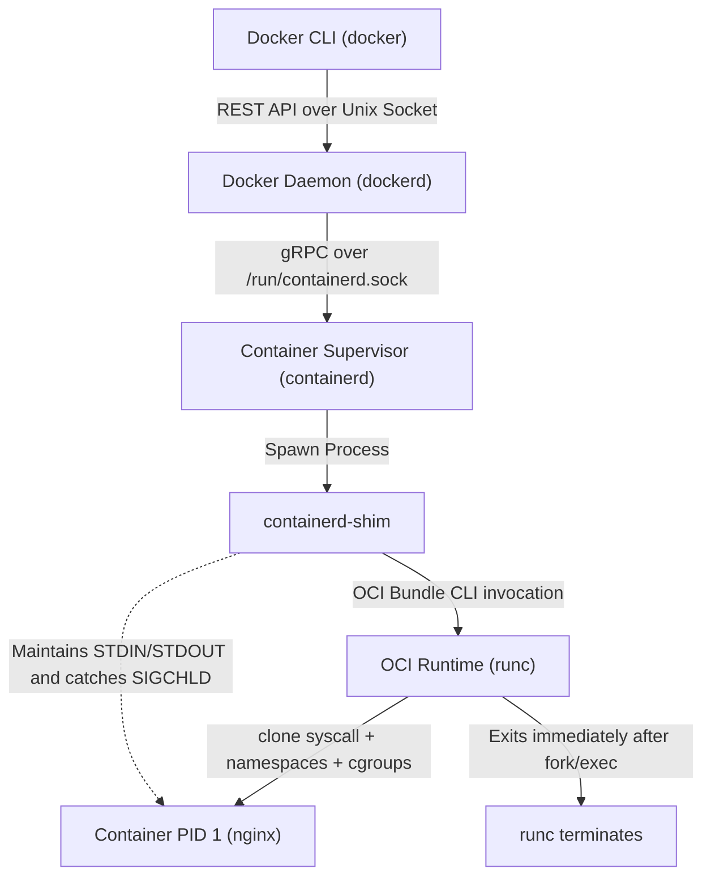
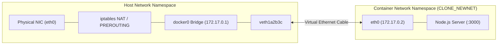

# Learn Docker: Enterprise Architecture, Container Internals & OCI Platform

[](https://github.com/manthanank/learn-docker/actions/workflows/ci.yml)
[](https://github.com/manthanank/learn-docker/actions/workflows/docker.yml)
[](https://github.com/manthanank/learn-docker/actions/workflows/releases.yml)
[](https://nodejs.org/)
[](LICENSE)
[](https://opencontainers.org/)

An authoritative, enterprise-grade engineering reference manual and interactive simulator for **container virtualization**, **CPython/Node/Go containerization**, **Linux kernel primitives (Namespaces & Cgroups v2)**, **Overlay2 UnionFS & Copy-on-Write (CoW)**, **Docker networking & iptables NAT**, **BuildKit multi-stage engineering**, and **staff-level container architecture**.

---

## Table of Contents
0. [Containerization Fundamentals & OCI Standards](#0-containerization-fundamentals--oci-standards)
   - [Virtual Machines vs Containers (Hypervisor vs Kernel Sharing)](#virtual-machines-vs-containers-hypervisor-vs-kernel-sharing)
   - [The OCI Specifications (Image Spec, Runtime Spec, Distribution Spec)](#the-oci-specifications-image-spec-runtime-spec-distribution-spec)
   - [The Modern Container Stack: dockerd, containerd, containerd-shim, runc](#the-modern-container-stack-dockerd-containerd-containerd-shim-runc)
1. [Linux Kernel Primitives: The Anatomy of a Container](#1-linux-kernel-primitives-the-anatomy-of-a-container)
   - [Linux Namespaces Deep Dive (PID, NET, MNT, UTS, IPC, USER, CGROUP)](#linux-namespaces-deep-dive-pid-net-mnt-uts-ipc-user-cgroup)
   - [Cgroups v2 Architecture & Resource Throttling (CFS Quotas, OOM Killer)](#cgroups-v2-architecture--resource-throttling-cfs-quotas-oom-killer)
   - [Linux Capabilities & Privilege Dropping](#linux-capabilities--privilege-dropping)
   - [Seccomp Profiles & Linux Security Modules (AppArmor / SELinux)](#seccomp-profiles--linux-security-modules-apparmor--selinux)
2. [Storage Drivers, UnionFS & Overlay2 Deep Dive](#2-storage-drivers-unionfs--overlay2-deep-dive)
   - [Architecture of UnionFS & Overlay2](#architecture-of-unionfs--overlay2)
   - [LowerDir, UpperDir, WorkDir, and MergedDir Dynamics](#lowerdir-upperdir-workdir-and-mergeddir-dynamics)
   - [Copy-on-Write (CoW) Mechanics at the Inode Level](#copy-on-write-cow-mechanics-at-the-inode-level)
   - [Deletion Mechanics: Whiteout Files (.wh.*) & Opaque Dirs](#deletion-mechanics-whiteout-files-wh-and-opaque-dirs)
3. [Docker Networking Architecture & Traffic Routing](#3-docker-networking-architecture--traffic-routing)
   - [Network Drivers: Bridge, Host, Overlay, Macvlan, None](#network-drivers-bridge-host-overlay-macvlan-none)
   - [Virtual Ethernet (veth) Pairs & docker0 Linux Bridge](#virtual-ethernet-veth-pairs--docker0-linux-bridge)
   - [iptables NAT, Port Forwarding & Connection Tracking](#iptables-nat-port-forwarding--connection-tracking)
   - [Embedded DNS (127.0.0.11) & User-Defined Bridges](#embedded-dns-1270011--user-defined-bridges)
4. [Production Dockerfile Engineering & BuildKit](#4-production-dockerfile-engineering--buildkit)
   - [BuildKit Architecture & Cache Mounts](#buildkit-architecture--cache-mounts)
   - [Multi-Stage Builds: Build vs Runtime Separation](#multi-stage-builds-build-vs-runtime-separation)
   - [Secret Mounts vs Environment Injection](#secret-mounts-vs-environment-injection)
   - [Distroless Images, Alpine vs Debian Slim, and Scratch Containers](#distroless-images-alpine-vs-debian-slim-and-scratch-containers)
   - [Signals & PID 1 Init Systems (tini, dumb-init, exec form vs shell form)](#signals--pid-1-init-systems-tini-dumb-init-exec-form-vs-shell-form)
5. [Docker Compose & Multi-Service Orchestration](#5-docker-compose--multi-service-orchestration)
   - [Compose V2 Specification & Dependency DAG Resolution](#compose-v2-specification--dependency-dag-resolution)
   - [Healthcheck Bootstrapping (depends_on with condition)](#healthcheck-bootstrapping-depends_on-with-condition)
   - [Volume Architectures: Named Volumes vs Bind Mounts vs tmpfs](#volume-architectures-named-volumes-vs-bind-mounts-vs-tmpfs)
6. [Enterprise Security & CIS Benchmark Hardening](#6-enterprise-security--cis-benchmark-hardening)
   - [CIS Docker Benchmark Hardening Checklist](#cis-docker-benchmark-hardening-checklist)
   - [Rootless Docker Architecture & User Namespaces](#rootless-docker-architecture--user-namespaces)
   - [Read-Only Root Filesystem (--read-only) with Ephemeral Mounts](#read-only-root-filesystem---read-only-with-ephemeral-mounts)
   - [Container Breakout Mitigations & Attack Vector Taxonomy](#container-breakout-mitigations--attack-vector-taxonomy)
7. [Enterprise Docker CLI & Diagnostics Power-Tools Cheatsheet](#7-enterprise-docker-cli--diagnostics-power-tools-cheatsheet)
   - [Container Lifecycle & Signal Commands](#container-lifecycle--signal-commands)
   - [Image Engineering, Buildx & Multi-Arch](#image-engineering-buildx--multi-arch)
   - [Advanced JSON Inspection & Go Templates](#advanced-json-inspection--go-templates)
   - [Real-Time Observability: Stats, Top & Events](#real-time-observability-stats-top--events)
   - [System Cleanup & Disk Space Reclamation](#system-cleanup--disk-space-reclamation)
8. [Docker to Kubernetes (K8s) Architectural Migration Guide](#8-docker-to-kubernetes-k8s-architectural-migration-guide)
   - [Docker Compose to Kubernetes Conceptual Matrix](#docker-compose-to-kubernetes-conceptual-matrix)
   - [Side-by-Side Manifest Migration (Compose to Deployment & Service)](#side-by-side-manifest-migration-compose-to-deployment--service)
   - [Probes vs Docker Healthcheck (Liveness, Readiness, Startup)](#probes-vs-docker-healthcheck-liveness-readiness-startup)
9. [Staff & Principal DevOps / Containerization Interview Masterclass (25 Q&A)](#9-staff--principal-devops--containerization-interview-masterclass-25-qa)
10. [Interactive Simulator, CLI & REST API Reference](#10-interactive-simulator-cli--rest-api-reference)

---
## 0. Containerization Fundamentals & OCI Standards

### Virtual Machines vs Containers (Hypervisor vs Kernel Sharing)

Containers and Virtual Machines (VMs) solve workload isolation through distinct architectural layers:

```text
+-------------------------------------------------------+   +-------------------------------------------------------+
|                    VIRTUAL MACHINE                    |   |                       CONTAINER                       |
+-------------------------------------------------------+   +-------------------------------------------------------+
| Application A     | Application B                     |   | Application A     | Application B                     |
| App Binaries/Libs | App Binaries/Libs                 |   | App Binaries/Libs | App Binaries/Libs                 |
+-------------------+-----------------------------------+   +-------------------+-----------------------------------+
| Guest OS (Linux)  | Guest OS (Windows/Linux)          |   | Container Isolation Engine (Namespaces, Cgroups, CoW) |
+-------------------+-----------------------------------+   +-------------------------------------------------------+
| Virtual Hardware (vCPU, vRAM, vNIC via QEMU/KVM)      |   | Shared Host Linux Kernel (syscall interface)          |
+-------------------------------------------------------+   +-------------------------------------------------------+
| Type-1 / Type-2 Hypervisor (ESXi, KVM, Hyper-V)       |   | Host Physical Hardware (CPU, RAM, NIC)                |
+-------------------------------------------------------+   +-------------------------------------------------------+
| Host Physical Hardware                                |
+-------------------------------------------------------+
```

| Architectural Metric | Virtual Machine (VM) | Container (OCI / Docker) |
| :--- | :--- | :--- |
| **Isolation Boundary** | Hardware abstraction via Hypervisor (VT-x / AMD-V) | Linux kernel primitives (Namespaces & Cgroups) |
| **Operating System** | Dedicated Guest OS Kernel per VM | Shared Host Linux Kernel |
| **Startup Latency** | Tens of seconds to minutes | Milliseconds (process spawn) |
| **Memory Footprint** | Gigabytes (kernel + systemd + daemons) | Megabytes (only process memory + shared page cache) |
| **Density** | Low to Moderate (tens of VMs per host) | Extreme (hundreds to thousands per host) |
| **I/O Performance** | Emulated / VirtIO block & network layer | Near-native bare-metal system call execution |

---

### The OCI Specifications (Image Spec, Runtime Spec, Distribution Spec)

The **Open Container Initiative (OCI)** is an open governance body under the Linux Foundation that standardizes container formats:

1. **OCI Image Specification (`image-spec`)**:
   - Defines an interoperable container image layout consisting of a **Manifest**, an **Image Configuration JSON** (environment variables, working directory, entrypoints), and **Content-Addressable Layer Tarballs** (diff filesystems compressed with gzip or zstd).
2. **OCI Runtime Specification (`runtime-spec`)**:
   - Standardizes the configuration, execution environment, and lifecycle of a container on disk (`config.json` bundle). Defines operations: `create`, `start`, `kill`, `delete`, and hooks (`prestart`, `createRuntime`, `poststop`).
3. **OCI Distribution Specification (`distribution-spec`)**:
   - Standardizes the HTTP/2 API protocol for pushing, pulling, discovering, and cataloging container images and artifacts across container registries (DockerHub, GitHub Packages, Harbor, AWS ECR).

---

### The Modern Container Stack: dockerd, containerd, containerd-shim, runc

The execution of `docker run -d -p 80:80 nginx` traverses a decoupled, production-grade micro-architecture:



- **`dockerd`**: High-level daemon handling developer ergonomics, CLI REST endpoints, image building (BuildKit), volume management, user-defined bridge networking, and secret storage.
- **`containerd`**: CNCF graduated container runtime supervisor. Manages complete container lifecycles, image pulling, unpacks layers into snapshotter targets, and tracks container execution state.
- **`containerd-shim`**: Sits between `containerd` and the running container process. Keeps STDIN, STDOUT, and STDERR FIFO descriptors open and captures process exit codes without requiring `containerd` to remain connected. This enables seamless `dockerd` and `containerd` daemon upgrades without restarting running containers!
- **`runc`**: The low-level reference implementation of the OCI runtime. Written in Go and C, it interacts directly with the Linux kernel: calls `clone(2)` with `CLONE_NEW*` flags, configures `cgroups`, executes `pivot_root`, and hands off execution to the user application binary. `runc` terminates immediately after launching the container.

---
## 1. Linux Kernel Primitives: The Anatomy of a Container

There is no such thing as a "container" object in the Linux kernel. A container is simply a standard Linux process isolated through **Namespaces**, throttled by **Control Groups (Cgroups)**, restricted by **Capabilities**, and filtered by **Seccomp**.

### Linux Namespaces Deep Dive (PID, NET, MNT, UTS, IPC, USER, CGROUP)

Linux Namespaces wrap a global system resource in an abstraction that makes it appear to the processes within the namespace that they have their own isolated instance of the resource:

```text
+---------------------------------------------------------------------------------------------+
|                                    LINUX NAMESPACES TAXONOMY                                |
+---------------+---------------------+-------------------------------------------------------+
| Namespace     | Kernel Flag         | Isolated System Resource                              |
+---------------+---------------------+-------------------------------------------------------+
| **PID**       | `CLONE_NEWPID`      | Process IDs (PID 1 inside container, maps to host PID)|
| **NET**       | `CLONE_NEWNET`      | Network devices, IP routing tables, iptables, ports   |
| **MNT**       | `CLONE_NEWNS`       | Filesystem mount points (chroot, pivot_root)          |
| **UTS**       | `CLONE_NEWUTS`      | Hostname and NIS domain name                          |
| **IPC**       | `CLONE_NEWIPC`      | POSIX message queues and System V IPC shared memory   |
| **USER**      | `CLONE_NEWUSER`     | UID and GID mapping (root in container is non-root)   |
| **CGROUP**    | `CLONE_NEWCGROUP`   | Cgroup hierarchy visibility in /proc/self/cgroup       |
| **TIME**      | `CLONE_NEWTIME`     | Boot and monotonic system clock virtualization        |
+---------------+---------------------+-------------------------------------------------------+
```

#### The PID Namespace & PID 1 Responsibilities
Inside a container PID namespace, the entrypoint process is assigned **PID 1**. On the host, the exact same process appears under an arbitrary host PID (e.g. PID 18452).

```text
Host Process Tree:
  systemd (PID 1)
     ├── containerd (PID 842)
     │     └── containerd-shim (PID 18450)
     │           └── node server.js (Host PID 18452) ─── [Inside Container PID Namespace: PID 1]
     │                 └── worker-thread (Host PID 18459) [Inside Container PID Namespace: PID 2]
```

**Critical PID 1 Responsibilities in Containers**:
1. **Signal Forwarding**: In Linux, the kernel suppresses default signal dispositions (such as terminating on `SIGTERM`) for PID 1 unless the process registers an explicit signal handler. If an application (e.g. Node.js or Python) does not trap `SIGTERM`, running `docker stop` will hang for 10 seconds before being forcibly killed with `SIGKILL` (exit code 137).
2. **Zombie Process Reaping**: When child processes terminate, they become "zombies" (`<defunct>`) until their parent reads their exit status via `waitpid()`. If an intermediate parent terminates, the orphaned zombie is adopted by PID 1. If PID 1 does not continuously reap zombies, the OS process table exhausts.

---

### Cgroups v2 Architecture & Resource Throttling (CFS Quotas, OOM Killer)

While namespaces govern **what a process can see**, Control Groups (Cgroups) govern **how much a process can consume**.

#### Cgroups v1 vs Cgroups v2
- **Cgroups v1**: Featured multiple independent hierarchies for each controller (`/sys/fs/cgroup/memory`, `/sys/fs/cgroup/cpu`). Controllers could not communicate, leading to writeback cache deadlocks and broken I/O throttling.
- **Cgroups v2**: Implements a **unified single-hierarchy tree** (`/sys/fs/cgroup`). Controllers are enabled dynamically per node, ensuring synchronized CPU, memory, and blkio accounting.

```text
/sys/fs/cgroup/
  ├── cgroup.controllers (cpu memory io pids)
  ├── cgroup.subtree_control
  └── docker/
        └── <container-id>/
              ├── cpu.max          (CFS quota & period: e.g. "50000 100000" = 0.5 CPU)
              ├── cpu.weight       (Relative CPU share: 1..10000, default 100)
              ├── memory.max       (Hard memory limit: e.g. "536870912" = 512MB)
              ├── memory.high      (Soft throttling boundary)
              ├── memory.current   (Active memory consumption)
              ├── memory.events    (OOM kill counters: "oom 1")
              └── pids.max         (Fork-bomb guard: maximum concurrent processes)
```

#### Completely Fair Scheduler (CFS) Throttling
Docker configures CPU limits through the Linux CFS scheduler:
```text
Allocated CPU Cores = (cpu.max quota) / (cpu.max period)
```
For example, `--cpus=1.5` sets `cpu.max` to `150000 100000`. If a multi-threaded workload attempts to consume more than 150ms of CPU runtime within a 100ms wall-clock period, the kernel throttles the process until the next CFS period commences.

#### The Linux Out-Of-Memory (OOM) Killer
When a container's memory usage reaches `memory.max` and swap is disabled (`--memory-swap` set equal to `--memory`), the kernel invokes `mem_cgroup_out_of_memory()`. The OOM Killer evaluates the badness score of processes inside the cgroup and terminates the highest consumer with `SIGKILL` (Linux exit code 137).

---

### Linux Capabilities & Privilege Dropping

Linux divides the traditional root superuser privilege into independent units called **Capabilities** (`capabilities(7)`). By default, Docker drops dangerous capabilities:

```text
+--------------------------------------------------------------------------------------+
|                           DOCKER DEFAULT CAPABILITIES AUDIT                          |
+--------------------------+-----------------------------------------------------------+
| Retained Capability      | Security Purpose                                          |
+--------------------------+-----------------------------------------------------------+
| `CAP_CHOWN`              | Make arbitrary changes to file UIDs/GIDs                  |
| `CAP_DAC_OVERRIDE`       | Bypass file read, write, and execute permission checks    |
| `CAP_FOWNER`             | Bypass permission checks on operations requiring file own |
| `CAP_FSETID`             | Retain setuid/setgid bits when modifying files            |
| `CAP_KILL`               | Send signals to arbitrary processes                       |
| `CAP_SETGID`             | Arbitrary manipulation of process GIDs                    |
| `CAP_SETUID`             | Arbitrary manipulation of process UIDs                    |
| `CAP_NET_BIND_SERVICE`   | Bind a socket to privileged ports below 1024              |
+--------------------------+-----------------------------------------------------------+
| Dropped by Default       | Dangerous Primitive (Attack Vector)                       |
+--------------------------+-----------------------------------------------------------+
| `CAP_SYS_ADMIN`          | **Container breakout vector**: Mount filesystems, ebpf    |
| `CAP_NET_RAW`            | Raw socket crafting, ARP poisoning, IP spoofing           |
| `CAP_SYS_PTRACE`         | Attach debugger to host/other processes via ptrace(2)     |
| `CAP_SYS_MODULE`         | Insert and remove arbitrary kernel modules into host      |
+--------------------------+-----------------------------------------------------------+
```

```bash
# Recommended Principle of Least Privilege: Drop ALL, add back only what is required:
docker run --cap-drop=ALL --cap-add=NET_BIND_SERVICE -p 80:80 my-app:latest
```

---
## 2. Storage Drivers, UnionFS & Overlay2 Deep Dive

### Architecture of UnionFS & Overlay2

Docker uses a layered union filesystem to enable fast container instantiation and minimal disk consumption. While earlier versions supported AUFS, Btrfs, and DeviceMapper, **Overlay2** is the modern standard supported directly by the Linux kernel (`fs/overlayfs/`).

```text
+-----------------------------------------------------------------------------------+
|                           OVERLAY2 DIRECTORY ARCHITECTURE                         |
+-----------------------------------------------------------------------------------+
|                                                                                   |
|  [ MergedDir ]    Unified container filesystem view presented to container apps   |
|         ▲         (/var/lib/docker/overlay2/<id>/merged)                          |
|         │                                                                         |
|  [ UpperDir ]     Read-Write Container Layer: New files, edits, and whiteouts     |
|         ▲         (/var/lib/docker/overlay2/<id>/diff)                            |
|         │                                                                         |
|  [ LowerDir ]     Immutable Read-Only Image Layers (Stacked Bottom-Up)            |
|                   (/var/lib/docker/overlay2/<l3>/diff : <l2>/diff : <l1>/diff)    |
|                                                                                   |
+-----------------------------------------------------------------------------------+
|  [ WorkDir ]      Internal atomic scratch directory for staging CoW renames       |
+-----------------------------------------------------------------------------------+
```

### Copy-on-Write (CoW) Mechanics at the Inode Level

Overlay2 employs **Copy-on-Write (CoW)** to optimize disk and memory utilization:

1. **File Read Operations**:
   - The kernel checks `UpperDir` first. If the file exists, it is served immediately.
   - If absent in `UpperDir`, the kernel traverses `LowerDir` stack from top to bottom and serves the file from the first layer containing it.
   - Multiple running containers using the same image share the exact same physical memory pages in the host kernel's Page Cache!
2. **File Modification Operations (Copy-Up)**:
   - When a container process opens an existing read-only file from a `LowerDir` with `O_WRONLY` or `O_RDWR`, Overlay2 intercepts the syscall.
   - The kernel performs an atomic copy-up of the file and its metadata from `LowerDir` into `UpperDir`.
   - Subsequent writes mutate only the copied replica in `UpperDir`. The underlying image layer remains completely unchanged!

### Deletion Mechanics: Whiteout Files (.wh.*) & Opaque Dirs

Because underlying lower layers are read-only blocks, Overlay2 cannot delete files from the host disk. Deletions are modeled via virtual filesystem markers:

1. **Whiteout Files (`.wh.<filename>`)**:
   - When a lower-layer file (e.g. `/etc/hosts`) is deleted inside the container, Overlay2 creates a character device file with device number `0/0` named `/etc/.wh.hosts` in the `UpperDir`.
   - The OverlayFS driver sees this marker and suppresses `/etc/hosts` from the `MergedDir` view.
2. **Opaque Directories (`.wh..wh..opq`)**:
   - When an existing directory is removed and replaced inside the container, Overlay2 writes an opaque attribute (`.wh..wh..opq`) inside the newly created directory in `UpperDir`.
   - This instructs the driver to hide all parent directory contents from underlying lower layers.

---
## 3. Docker Networking Architecture & Traffic Routing

### Network Drivers: Bridge, Host, Overlay, Macvlan, None

Docker abstracts container network connectivity through container network model (CNM) drivers:

```text
+-------------------+-----------------------------------------------------------------------+
| Network Driver    | Typical Architecture & Use Case                                       |
+-------------------+-----------------------------------------------------------------------+
| **bridge**        | Default single-host network. Creates private subnet (172.17.0.0/16).  |
|                   | Connected via Linux bridge (docker0) with iptables NAT.               |
| **host**          | Eliminates network isolation. Container shares host IP and network    |
|                   | namespace directly. Lowest latency; port collisions possible.        |
| **overlay**       | Multi-host distributed network. Encapsulates traffic using VXLAN      |
|                   | (port 4789). Powers Docker Swarm and Kubernetes Calico/Flannel.       |
| **macvlan**       | Assigns unique MAC address from physical LAN to container. Appears as |
|                   | a physical machine on network switch. Bypasses host NAT.              |
| **none**          | Complete air-gapped network isolation. Only loopback (lo) interface. |
+-------------------+-----------------------------------------------------------------------+
```

### Virtual Ethernet (veth) Pairs & docker0 Linux Bridge

When a container connects to a bridge network, Docker constructs a virtual link between namespaces:



1. **Virtual Ethernet (`veth`) Pair**: Acts as a virtual patch cord. Packets transmitted into `veth1a2b3c` in the host namespace emerge immediately on `eth0` inside the container namespace.
2. **Linux Bridge (`docker0`)**: Operates as a Layer-2 software switch. Forwards ARP broadcasts and Ethernet frames between containers residing on the same subnet.

### iptables NAT, Port Forwarding & Connection Tracking

When publishing a port with `-p 8080:3000`:
1. Docker adds a Destination NAT (DNAT) rule into the `PREROUTING` and `DOCKER` chains of the iptables `nat` table:
   ```bash
   -A DOCKER -p tcp -m tcp --dport 8080 -j DNAT --to-destination 172.17.0.2:3000
   ```
2. For outbound container requests accessing the public internet, Docker configures a Source NAT (SNAT / MASQUERADE) rule:
   ```bash
   -A POSTROUTING -s 172.17.0.0/16 ! -o docker0 -j MASQUERADE
   ```
   This replaces the private container IP (`172.17.0.2`) with the host's public IP before transmitting over WAN.

### Embedded DNS (127.0.0.11) & User-Defined Bridges
The default `docker0` bridge does **not** provide automatic container name resolution. However, creating a **user-defined bridge** (`docker network create my-net`) activates Docker's embedded DNS server running at `127.0.0.11`:
- Containers resolve each other by container name or service alias (`http://api:3000`).
- DNS lookups query `127.0.0.11:53`, which resolves internal container IP addresses dynamically.

---
## 4. Production Dockerfile Engineering & BuildKit

### BuildKit Architecture & Cache Mounts
**BuildKit** (`DOCKER_BUILDKIT=1`) revolutionizes container compilation with concurrent multi-stage graph resolution, secret mounts, and cache mounts:

```dockerfile
# syntax=docker/dockerfile:1.4
FROM node:22-alpine AS builder
WORKDIR /app

# Cache mount preserves npm/pip caches across builds on host disk!
RUN --mount=type=cache,target=/root/.npm     npm install -g pnpm

COPY package.json pnpm-lock.yaml ./
RUN --mount=type=cache,target=/root/.local/share/pnpm/store     pnpm install --frozen-lockfile
```

### Multi-Stage Builds: Build vs Runtime Separation
A gold-standard enterprise Dockerfile cleanly decouples compilers and dev tools from minimal production runners:

```dockerfile
# ========================================================
# Stage 1: Build & Compilation Environment
# ========================================================
FROM node:22-alpine AS builder
WORKDIR /app
COPY package*.json tsconfig.json ./
RUN npm ci
COPY src/ ./src/
RUN npm run build && npm prune --production

# ========================================================
# Stage 2: Hardened, Minimal Production Runner
# ========================================================
FROM node:22-alpine AS runner

# CIS Docker Benchmark 4.1: Enforce Non-Root User Execution
RUN addgroup -S -g 1001 appgroup && \
    adduser -S -u 1001 -G appgroup appuser

WORKDIR /app
ENV NODE_ENV=production PORT=3000

# Copy ONLY necessary artifacts from builder
COPY --from=builder --chown=appuser:appgroup /app/package*.json ./
COPY --from=builder --chown=appuser:appgroup /app/node_modules ./node_modules
COPY --from=builder --chown=appuser:appgroup /app/dist ./dist

# Drop root privileges
USER appuser

EXPOSE 3000
HEALTHCHECK --interval=30s --timeout=5s --start-period=5s --retries=3 \
  CMD wget --spider -q http://localhost:3000/health || exit 1

STOPSIGNAL SIGTERM
CMD ["node", "dist/server.js"]
```

### Secret Mounts vs Environment Injection

```dockerfile
# ANTI-PATTERN: Secrets baked into image layers forever!
# ARG GITHUB_TOKEN=secret
# RUN git clone https://${GITHUB_TOKEN}@github.com/org/repo.git

# PRODUCTION PATTERN: BuildKit Secret Mount (Zero footprint in image layers)
RUN --mount=type=secret,id=gh_token \
    TOKEN=$(cat /run/secrets/gh_token) && \
    git clone https://${TOKEN}@github.com/org/repo.git
```

Build with: `docker build --secret id=gh_token,src=~/.gh_token .`

### Signals & PID 1 Init Systems (tini, dumb-init, exec form vs shell form)

Always use the **JSON exec form** (`CMD ["node", "server.js"]`) instead of the **shell form** (`CMD node server.js`):
- **Shell Form**: Spawns `/bin/sh -c "node server.js"`. The shell becomes PID 1 and refuses to forward `SIGTERM` to the Node process upon `docker stop`.
- **Exec Form**: Executes `node server.js` directly as PID 1, allowing proper graceful shutdown and database connection draining.

For applications with child process spawning, use lightweight init systems:
```dockerfile
RUN apk add --no-cache tini
ENTRYPOINT ["/sbin/tini", "--"]
CMD ["node", "server.js"]
```

---
## 5. Docker Compose & Multi-Service Orchestration

### Compose V2 Specification & Dependency DAG Resolution

Docker Compose V2 is rewritten in Go and integrated natively into the Docker CLI as `docker compose`. It resolves dependencies using Directed Acyclic Graphs (DAGs):

```yaml
version: "3.8"

services:
  api:
    build:
      context: .
      dockerfile: Dockerfile
    ports:
      - "3000:3000"
    environment:
      - DATABASE_URL=postgres://dbuser:secret@db:5432/appdb
      - REDIS_URL=redis://redis:6379
    depends_on:
      db:
        condition: service_healthy
      redis:
        condition: service_started
    networks:
      - backend-net
    restart: unless-stopped

  db:
    image: postgres:16-alpine
    environment:
      POSTGRES_USER: dbuser
      POSTGRES_PASSWORD: secret
      POSTGRES_DB: appdb
    volumes:
      - pgdata:/var/lib/postgresql/data
    healthcheck:
      test: ["CMD-SHELL", "pg_isready -U dbuser -d appdb"]
      interval: 10s
      timeout: 5s
      retries: 5
    networks:
      - backend-net

  redis:
    image: redis:7-alpine
    networks:
      - backend-net

networks:
  backend-net:
    driver: bridge

volumes:
  pgdata:
    driver: local
```

### Volume Architectures: Named Volumes vs Bind Mounts vs tmpfs

```text
+-------------------+-----------------------------------+-----------------------------------+
| Volume Mount Type | Host Storage Location             | Enterprise Production Fit         |
+-------------------+-----------------------------------+-----------------------------------+
| **Named Volume**  | `/var/lib/docker/volumes/<name>`  | Databases, stateful persistent    |
|                   | Managed completely by Docker      | services. Best performance.       |
| **Bind Mount**    | Arbitrary host directory          | Local development hot-reloading   |
|                   | (e.g. `/home/user/project`)       | and mounting host config files.   |
| **tmpfs**         | Host RAM (Linux virtual memory)   | Sensitive tokens, ephemeral logs, |
|                   | Never written to disk             | session caches (wiped on exit).   |
+-------------------+-----------------------------------+-----------------------------------+
```

---
## 6. Enterprise Security & CIS Benchmark Hardening

### CIS Docker Benchmark Hardening Checklist

The Center for Internet Security (CIS) defines authoritative benchmarks for container security:

- [x] **Rule 4.1**: Ensure a non-root user is created and assigned in Dockerfile (`USER appuser`).
- [x] **Rule 4.2**: Verify container images are scanned for vulnerabilities prior to deployment.
- [x] **Rule 4.3**: Do not install unnecessary packages or package manager caches.
- [x] **Rule 4.4**: Ensure `HEALTHCHECK` instructions are defined in production stages.
- [x] **Rule 4.5**: Do not store secrets or access keys in `ENV` or `ARG` directives.
- [x] **Rule 5.1**: Ensure AppArmor or SELinux profile is active (`--security-opt apparmor=docker-default`).
- [x] **Rule 5.2**: Verify that Linux capabilities are restricted (`--cap-drop=ALL`).
- [x] **Rule 5.3**: Do not use the `--privileged` flag under any production circumstance.
- [x] **Rule 5.4**: Mount container root filesystem as read-only (`--read-only`).
- [x] **Rule 5.5**: Enforce memory and CPU cgroup limits (`--memory=512m --cpus=1.0`).

### Read-Only Root Filesystem (--read-only) with Ephemeral Mounts
Hardened production containers should prevent attackers from dropping malware or overwriting binaries:

```bash
docker run -d \
  --read-only \
  --tmpfs /tmp:rw,noexec,nosuid,size=64m \
  --tmpfs /run:rw,noexec,nosuid,size=16m \
  --cap-drop=ALL \
  --cap-add=NET_BIND_SERVICE \
  -p 3000:3000 \
  my-app:latest
```

---
## 7. Enterprise Docker CLI & Diagnostics Power-Tools Cheatsheet

### Container Lifecycle & Signal Commands

```bash
# Run container detached with automated restart policy and resource constraints
docker run -d \
  --name prod-api \
  --restart unless-stopped \
  --memory 512m --cpus 1.5 \
  -p 8080:3000 \
  -e NODE_ENV=production \
  -v app-data:/app/data \
  --health-cmd "wget -q --spider http://localhost:3000/health || exit 1" \
  --health-interval 30s \
  manthanank/learn-docker:latest

# Graceful termination (SIGTERM, default 10s timeout before SIGKILL)
docker stop -t 15 prod-api

# Immediate kernel termination (SIGKILL - exit code 137)
docker kill -s SIGKILL prod-api

# Send custom POSIX signal to container process (e.g. reload NGINX configs)
docker kill -s SIGHUP prod-api

# Pause/unpause process execution using Cgroups freezer controller
docker pause prod-api
docker unpause prod-api

# Execute interactive shell inside running container namespace
docker exec -it prod-api /bin/sh

# Override entrypoint during ad-hoc debugging
docker run --rm -it --entrypoint /bin/sh manthanank/learn-docker:latest
```

---

### Image Engineering, Buildx & Multi-Arch

```bash
# Build using modern BuildKit engine
DOCKER_BUILDKIT=1 docker build -t my-app:1.0.0 .

# Target specific intermediate stage in multi-stage Dockerfile
docker build --target builder -t my-app:build-artifacts .

# Create and bootstrap a multi-architecture Buildx builder instance
docker buildx create --name multi-builder --driver docker-container --bootstrap --use

# Build, tag, and push multi-architecture image (AMD64 + ARM64) in a single pass
docker buildx build \
  --platform linux/amd64,linux/arm64 \
  -t manthanank/learn-docker:latest \
  -t manthanank/learn-docker:1.3.0 \
  --push .

# Inspect multi-architecture image manifest list (OCI Index)
docker buildx imagetools inspect manthanank/learn-docker:latest

# Display image layer history, cached status, and layer size breakdown
docker history --no-trunc my-app:latest
```

---

### Advanced JSON Inspection & Go Templates

Docker CLI formats object metadata using Go template formatting:

```bash
# Extract private IP address of container on specific network
docker inspect -f '{{range .NetworkSettings.Networks}}{{.IPAddress}}{{end}}' prod-api

# Extract Host PID of PID 1 inside container
docker inspect -f '{{.State.Pid}}' prod-api

# Check container health status and failure logs
docker inspect -f '{{.State.Health.Status}}' prod-api
docker inspect -f '{{json .State.Health.Log}}' prod-api | jq .

# Inspect mounted volumes and host paths
docker inspect -f '{{range .Mounts}}{{.Source}} -> {{.Destination}} ({{.Type}}){{"\n"}}{{end}}' prod-api

# Extract exposed ports and host port bindings
docker inspect -f '{{json .NetworkSettings.Ports}}' prod-api | jq .

# Extract environment variables inside container
docker inspect -f '{{range .Config.Env}}{{println .}}{{end}}' prod-api
```

---

### Real-Time Observability: Stats, Top & Events

```bash
# Live streaming resource utilization (CPU %, Mem %, Net I/O, Block I/O, PIDs)
docker stats

# Batch non-streaming snapshot formatted as table
docker stats --no-stream --format "table {{.Name}}\t{{.CPUPerc}}\t{{.MemUsage}}\t{{.NetIO}}\t{{.PIDs}}"

# Display running processes inside container from host perspective
docker top prod-api aux

# Follow streaming stdout/stderr logs with timestamps and tail limit
docker logs -f --tail 100 --timestamps prod-api

# Monitor real-time daemon events (container death, OOM kills, mounts)
docker events --filter 'event=die' --filter 'event=oom'
```

---

### System Cleanup & Disk Space Reclamation

```bash
# Analyze comprehensive Docker disk space consumption (Images, Containers, Volumes, Build Cache)
docker system df -v

# Remove all stopped containers
docker container prune -f

# Remove all dangling (untagged) images
docker image prune -f

# Remove ALL unused images (not referenced by any existing container)
docker image prune -a -f

# Reclaim BuildKit build cache
docker builder prune -a -f --keep-storage 5GB

# Nuclear cleanup: Remove all stopped containers, unused networks, dangling images, and volumes
docker system prune -a --volumes -f
```

---
## 8. Docker to Kubernetes (K8s) Architectural Migration Guide

As enterprise applications graduate from single-node Docker Compose environments to multi-node distributed clusters, Docker primitives map systematically to Kubernetes API objects:

### Docker Compose to Kubernetes Conceptual Matrix

```text
+-----------------------------------+-----------------------------------+-----------------------------------+
| Docker / Docker Compose Primitive | Kubernetes Equivalent Object      | Architectural Role                |
+-----------------------------------+-----------------------------------+-----------------------------------+
| Container                         | **Container** (inside Pod)        | Smallest unit of computation      |
| Service (Single Container)        | **Pod**                           | Shared network & storage unit     |
| Service (Replicated Scaled)       | **Deployment** + **ReplicaSet**   | Declarative desired-state scaling |
| Stateful Service (Database)       | **StatefulSet**                   | Stable network IDs & disk binding |
| System Agent per Host             | **DaemonSet**                     | Exactly one copy per cluster node |
| Scheduled Batch Job               | **CronJob** / **Job**             | Finite task execution             |
| `ports: ["80:80"]`                | **Service** (ClusterIP/NodePort)  | Stable virtual IP & load balancer |
| Virtual Host / Reverse Proxy      | **Ingress** / Gateway API         | L7 routing, TLS termination       |
| `environment: [KEY=VAL]`          | **ConfigMap**                     | Decoupled runtime configuration   |
| Hardcoded Credentials             | **Secret**                        | Base64 encoded / KMS encrypted    |
| Named Volume                      | **PersistentVolumeClaim (PVC)**   | Dynamic block/file storage claim  |
| Bridge Network                    | **CNI Plugin** (Calico, Cilium)   | Flat Pod-to-Pod IP routability    |
| `HEALTHCHECK`                     | **Liveness & Readiness Probes**   | Health evaluation & traffic gates |
+-----------------------------------+-----------------------------------+-----------------------------------+
```

---

### Side-by-Side Manifest Migration (Compose to Deployment & Service)

#### Docker Compose Specification (`docker-compose.yml`)
```yaml
version: "3.8"
services:
  web:
    image: manthanank/learn-docker:latest
    ports:
      - "80:3000"
    environment:
      - NODE_ENV=production
      - PORT=3000
    deploy:
      replicas: 3
      resources:
        limits:
          cpus: "1.0"
          memory: 512M
    healthcheck:
      test: ["CMD", "wget", "-q", "--spider", "http://localhost:3000/health"]
      interval: 15s
```

#### Corresponding Kubernetes Manifest (`deployment.yaml` & `service.yaml`)
```yaml
apiVersion: apps/v1
kind: Deployment
metadata:
  name: learn-docker-deployment
  labels:
    app: learn-docker
spec:
  replicas: 3
  selector:
    matchLabels:
      app: learn-docker
  template:
    metadata:
      labels:
        app: learn-docker
    spec:
      securityContext:
        runAsNonRoot: true
        runAsUser: 1001
      containers:
        - name: web
          image: manthanank/learn-docker:latest
          imagePullPolicy: IfNotPresent
          ports:
            - containerPort: 3000
          env:
            - name: NODE_ENV
              value: "production"
            - name: PORT
              value: "3000"
          resources:
            requests:
              cpu: "250m"
              memory: "128Mi"
            limits:
              cpu: "1000m"
              memory: "512Mi"
          livenessProbe:
            httpGet:
              path: /health
              port: 3000
            initialDelaySeconds: 10
            periodSeconds: 15
          readinessProbe:
            httpGet:
              path: /health
              port: 3000
            initialDelaySeconds: 5
            periodSeconds: 5
---
apiVersion: v1
kind: Service
metadata:
  name: learn-docker-service
spec:
  type: ClusterIP
  selector:
    app: learn-docker
  ports:
    - protocol: TCP
      port: 80
      targetPort: 3000
```

---

### Probes vs Docker Healthcheck (Liveness, Readiness, Startup)

In Docker, a failed `HEALTHCHECK` sets the container status to `unhealthy`. Unless an external orchestrator is used, the container continues running.
<br><br>
In Kubernetes, health evaluation is partitioned into three specialized probes:
1. **Startup Probe**: Blocks liveness and readiness checks until slow-starting applications (e.g. JVM warm-up or database migrations) finish initialization.
2. **Liveness Probe**: Detects deadlocks and unrecoverable thread starvation. Failure triggers immediate container restart (re-spawn).
3. **Readiness Probe**: Determines whether the container is ready to accept user network traffic. If failing, Kubernetes temporarily removes the Pod from Service endpoints without restarting the process.

---
## 9. Staff & Principal DevOps / Containerization Interview Masterclass (25 Q&A)

### Q1: What is the exact execution flow when running `docker run`? Detail every boundary crossed.
**Answer:**
When `docker run` executes:
1. **Client -> Daemon**: The Docker CLI converts user parameters into an HTTP JSON request transmitted across `/var/run/docker.sock` to `dockerd`.
2. **Daemon -> Registry**: If image layers are not cached locally, `dockerd` delegates pulling to `containerd` via gRPC, downloading and verifying content-addressable layer SHA256 hashes against the manifest.
3. **Storage Snapshot**: `containerd` invokes its snapshotter driver (`overlay2`) to prepare an immutable lower layer stack, an empty read-write upper layer, and a work directory.
4. **OCI Spec Assembly**: `containerd` serializes container configuration into an OCI `config.json` bundle containing mount paths, namespace flags, cgroup limits, and capability sets.
5. **Shim & runc**: `containerd` forks a `containerd-shim` process. The shim executes `runc create <id>`.
6. **Kernel Execution**: `runc` invokes the `clone(2)` syscall with namespace flags (`CLONE_NEWPID`, `CLONE_NEWNET`, `CLONE_NEWNS`, etc.), writes resource constraints into `/sys/fs/cgroup/<id>/`, executes `pivot_root`, drops Linux capabilities, applies seccomp filters, and executes `execve` to start PID 1.
7. **runc Exit**: `runc` exits immediately. The `containerd-shim` process remains as the parent of PID 1 to handle signal propagation and I/O streaming.

---

### Q2: How does `pivot_root` differ from `chroot`, and why is `chroot` insufficient for container security?
**Answer:**
`chroot(2)` only alters the apparent root directory (`/`) for the current process and its children. It does not alter mount namespaces. If an attacker gains root privileges inside a `chroot` jail, they can break out by creating a temporary directory, opening a file descriptor to the original root via relative traversal (`../../`), and calling `chroot` back to the host filesystem.
<br><br>
In contrast, `pivot_root(2)` swaps the entire mount namespace root. It moves the root filesystem of the current process to a `put_old` directory and makes the new root filesystem the true root for all processes in the mount namespace. Once `pivot_root` succeeds, the old host root is unmounted (`umount2(put_old, MNT_DETACH)`), completely eliminating any file descriptor path back to the host root.

---

### Q3: Why does `docker stop` send SIGTERM and then SIGKILL after a timeout? How does Node.js or Python behave?
**Answer:**
`docker stop` allows applications to perform graceful shutdown: draining incoming HTTP requests, completing in-flight database transactions, and releasing distributed locks. It dispatches `SIGTERM` (signal 15) to PID 1 inside the container and starts a countdown timer (default 10 seconds). If PID 1 has not terminated when the timer expires, the daemon issues `SIGKILL` (signal 9), which cannot be caught or ignored.
<br><br>
By default, Node.js and Python runtimes ignore `SIGTERM` when running as PID 1 unless explicit signal handlers are attached (`process.on('SIGTERM', ...)` in Node.js, `signal.signal(signal.SIGTERM, ...)` in Python). If developers omit signal trapping, `docker stop` always incurs the full 10-second penalty before hard crash!

---

### Q4: Explain the difference between Docker `ENTRYPOINT` and `CMD`. How do they interact?
**Answer:**
`ENTRYPOINT` specifies the executable that should always run when the container starts. `CMD` specifies default arguments that are appended to `ENTRYPOINT`.
- If both are specified in exec form: `ENTRYPOINT ["nginx"]` and `CMD ["-g", "daemon off;"]` evaluates to `nginx -g "daemon off;"`.
- If the user runs `docker run my-image -c /custom.conf`, the user argument overrides `CMD`, resulting in `nginx -c /custom.conf`.
- If `ENTRYPOINT` is defined in shell form (`ENTRYPOINT nginx -g "daemon off;"`), all `CMD` arguments and CLI parameters are ignored.

---

### Q5: What is Free-Threaded Python and how does PEP 703 impact Python Docker containers?
**Answer:**
Historically, Python containers scaling across multiple CPU cores required multi-process models (such as `gunicorn -w 4` or Celery workers) due to the Global Interpreter Lock (GIL). Multi-process architectures replicate memory footprints and complicate shared state. Python 3.13 introduces experimental **free-threaded CPython (PEP 703)**, removing the GIL via biased reference counting and mimalloc thread-safe memory allocators. In Docker containers, this allows a single Python container process to scale seamlessly across all CPU cores allocated via `--cpus=N` using multi-threading!

---

### Q6: How does Docker Compose resolve dependencies using Directed Acyclic Graphs (DAGs)?
**Answer:**
Docker Compose parses `depends_on` declarations into a Directed Acyclic Graph (DAG) where nodes represent services and directed edges represent boot dependencies. It applies **Kahn's Algorithm** or depth-first search (DFS) to compute the **Topological Sort**:
1. It calculates the in-degree (number of upstream dependencies) of every service.
2. Services with in-degree 0 (e.g. database, redis) are scheduled in Level 1 and booted concurrently.
3. Once upstream services pass readiness probes (`condition: service_healthy`), downstream services (e.g. API server, worker) are unblocked and started.
4. If a dependency loop is detected (e.g. Service A -> Service B -> Service A), Compose halts execution with a cyclic dependency error.

---

### Q7: What causes "Container Port Not Accessible" when a process binds to `127.0.0.1`?
**Answer:**
Each container has its own isolated Network Namespace (`CLONE_NEWNET`) with its own independent loopback interface (`lo`). If a server inside a container listens on `127.0.0.1:3000`, it binds exclusively to the container's private loopback adapter. Host port forwarding maps host requests to the container's virtual ethernet adapter (`eth0` at `172.17.0.2`). Packets arriving from `eth0` are dropped because the process is only listening on `lo`.
<br><br>
*Resolution:* Always bind servers inside containers to all interfaces: `0.0.0.0` or `::` (IPv6).

---

### Q8: What are Multi-Arch Container Images and how does Docker manifest list / OCI Index work?
**Answer:**
Modern cloud infrastructure runs on heterogeneous hardware (AMD64 x86_64 in Intel/AMD servers and ARM64 aarch64 in AWS Graviton, Apple Silicon, and Raspberry Pi). A **Manifest List** (or OCI Image Index) acts as a fat manifest containing pointers to architecture-specific image manifests. When a client issues `docker pull`, Docker inspects the local machine's architecture (`os` and `architecture`), queries the Manifest List, and pulls only the matching layer binaries.

---

### Q9: What is Rootless Docker, and how does it protect against kernel 0-day breakouts?
**Answer:**
Standard Docker executes `dockerd` and `containerd` as the host `root` user (`UID 0`). If a vulnerability in the Linux kernel or `runc` allows a container breakout (e.g. CVE-2019-5736 or CVE-2024-21626), the attacker lands on the host system with unrestricted root privileges.
<br><br>
**Rootless Docker** executes the entire container engine inside a user namespace (`CLONE_NEWUSER`). Host UID 1000 is mapped to UID 0 inside the engine namespace. If an attacker achieves a complete container breakout, they emerge on the host operating system as an unprivileged user (UID 1000) with zero access to host kernel modules, hardware devices, or other users' data!

---

### Q10: How does BuildKit cache mounting (`--mount=type=cache`) prevent image bloat?
**Answer:**
Standard Dockerfile instructions like `RUN npm install` download package archives into local directories (e.g. `/root/.npm`). In legacy builds, this cache is permanently stored in the resulting image layer unless manually cleared in the same instruction.
<br><br>
BuildKit's `--mount=type=cache,target=/root/.npm` mounts a persistent cache directory from the host BuildKit daemon directly into the build container during execution. The compiler reads and writes dependencies to this cache across successive builds, but the cache directory is excluded from the exported container image layer, producing ultra-compact production images with instantaneous rebuild speeds!

---

### Q11: What is the function of the `STOPSIGNAL` directive in a Dockerfile?
**Answer:**
By default, Docker sends `SIGTERM` when executing `docker stop`. Some applications and proxies do not use `SIGTERM` for graceful termination. For example, NGINX uses `SIGQUIT` for graceful worker shutdown, while `SIGTERM` triggers immediate abrupt abort. Defining `STOPSIGNAL SIGQUIT` in the Dockerfile informs the Docker runtime to dispatch `SIGQUIT` on `docker stop`, ensuring NGINX finishes serving active HTTP requests before exiting.

---

### Q12: How does the Linux Seccomp (Secure Computing) filter enhance container security?
**Answer:**
The Linux kernel exposes hundreds of system calls (`syscalls`). Most containerized applications only require a fraction (e.g. ~40-70 syscalls). Docker applies a default BPF (Berkeley Packet Filter) Seccomp profile that blocks over 40 dangerous syscalls, including `reboot`, `sys_chroot`, `kexec_load`, `keyctl`, `mount`, and `ptrace`. Even if an attacker gains root privileges inside a container, Seccomp intercepts attempts to call blocked syscalls and returns `EPERM` (Operation not permitted).

---

### Q13: What is the difference between `docker pause` and `docker stop`?
**Answer:**
- `docker stop`: Dispatches a `SIGTERM` signal to PID 1, allows process cleanup, and terminates the container. Memory pages and process states are released.
- `docker pause`: Uses the Linux Cgroups **freezer controller** (`cgroup.freeze` or `cgroups v1 freezer`). It suspends all processes in the container in their current state without signaling or terminating them. Memory state remains frozen in RAM. `docker unpause` resumes execution instantaneously without rebooting.

---

### Q14: How does Docker implement the Embedded DNS Server (`127.0.0.11`)?
**Answer:**
In user-defined bridge networks, Docker creates an iptables loopback redirection inside the container's network namespace:
- Any DNS request destined for `127.0.0.11:53` is forwarded to an internal listening socket managed by `dockerd`.
- The daemon checks its internal container registry table. If the queried hostname matches a container name or service alias on the same network, it returns the container's private IP.
- If unresolvable internally, Docker forwards the DNS query to external upstream DNS resolvers defined in `/etc/resolv.conf`.

---

### Q15: Why is `ADD` discouraged in favor of `COPY` for local files in a Dockerfile?
**Answer:**
`COPY` performs a simple, predictable copy of local files or directories into the container filesystem.
`ADD` has two additional implicit behaviors:
1. It downloads remote URLs into the container filesystem.
2. It automatically decompresses local tarballs (`.tar`, `.tar.gz`, `.tar.bz2`) into the destination directory.
Using `ADD` indiscriminately risks unexpected archive unpacking and complicates build caching. The recommended practice is to use `COPY` for all local files and use `ADD` strictly when auto-extracting tar archives.

---

### Q16: How do Distroless container images improve enterprise security posture?
**Answer:**
Distroless images (championed by Google) contain only application runtime binaries and dependencies—completely stripping out Linux shells (`/bin/sh`, `/bin/bash`), package managers (`apk`, `apt`), and core utilities (`curl`, `ls`, `cat`).
<br><br>
**Security Benefits**:
- Reduces Common Vulnerabilities and Exposures (CVEs) in base images to near zero.
- Prevents script-kiddie container breakouts: attackers cannot spawn a reverse shell or download malware via `curl` because no shell or binary loader exists in the container!

---

### Q17: What are Docker Volume drivers, and how do they enable distributed stateful workloads?
**Answer:**
The Docker Volume plugin interface allows third-party storage providers to manage container storage outside the local host filesystem:
- **Local Driver**: Stores data in `/var/lib/docker/volumes/` on the local host.
- **Distributed Drivers (NFS, AWS EFS, Ceph, GlusterFS, Portworx)**: Mount shared network storage into containers across multiple physical nodes. If a container crashes and reschedules on a different physical host, the volume driver reattaches the same network block storage seamlessly.

---

### Q18: How does the Linux CFS scheduler calculate CPU bandwidth throttle counters?
**Answer:**
Under Cgroups v2, CPU limits are tracked in `/sys/fs/cgroup/cpu.stat`:
- `nr_periods`: Total number of CFS enforcement periods elapsed.
- `nr_throttled`: Total number of periods in which processes inside the cgroup exhausted their quota and were throttled.
- `throttled_usec`: Total microseconds the processes were suspended waiting for quota reset.
Monitoring `nr_throttled / nr_periods` is the industry standard metric for detecting CPU starvation in containerized microservices.

---

### Q19: What is the purpose of `.dockerignore` and how does it optimize build context performance?
**Answer:**
When running `docker build .`, the Docker CLI tarballs the entire directory into a **Build Context** and streams it across the socket to the Docker daemon. If `.git/`, `node_modules/`, test fixtures, or large datasets are present, context transfer can take gigabytes of memory and minutes of transfer time. `.dockerignore` filters out unwanted files before building the context, accelerating build performance and preventing sensitive files (e.g. `.env`) from leaking into image layers.

---

### Q20: Explain the function and security implications of the Docker socket (`/var/run/docker.sock`).
**Answer:**
`/var/run/docker.sock` is the Unix domain socket through which the Docker CLI communicates with the Docker daemon (`dockerd`). Because `dockerd` runs with root privileges, anyone with write access to this socket possesses **equivalent host root access**.
<br><br>
Mounting `/var/run/docker.sock` into a container (e.g. `docker run -v /var/run/docker.sock:/var/run/docker.sock`) is a critical security vulnerability: any process inside the container can instruct the host daemon to spawn a privileged container mounting the host root filesystem (`/`), achieving instant host compromise!

---

### Q21: What is the difference between Macvlan and IPvlan network drivers?
**Answer:**
- **Macvlan**: Assigns a unique MAC address and IP address to each container. Packets appear directly on the physical switch. However, many enterprise switches restrict the number of MAC addresses per port (port security), limiting container density.
- **IPvlan**: All containers on the host share the physical host NIC's single MAC address, but each container receives an independent IP address. This overcomes switch MAC address limits while providing direct Layer-2/Layer-3 routing without bridge NAT overhead.

---

### Q22: What is the OCI Runtime Hook specification?
**Answer:**
OCI hooks allow custom binaries to execute at precise stages of container setup:
- `prestart`: Executed after namespaces and cgroups are created, but before `pivot_root` and before the container process starts. Frequently used by network plugins (CNI) to create veth pairs.
- `createRuntime`: Executed in the runtime namespace after resources are configured.
- `poststop`: Executed after the container process terminates to clean up network interfaces and temporary storage.

---

### Q23: How does Docker Swarm differ from Kubernetes for microservice orchestration?
**Answer:**
- **Docker Swarm**: Built directly into `dockerd`. Extremely easy to set up and operate (`docker swarm init`). Best suited for small to mid-sized engineering teams prioritizing developer ergonomics over extreme customizability.
- **Kubernetes (K8s)**: CNCF industry standard enterprise orchestrator. Decoupled control plane (etcd, kube-apiserver, kube-scheduler, kube-controller-manager). Supports advanced primitives (CRDs, Operators, Pod Disruption Budgets, HPA/VPA, Service Meshes). Higher operational complexity.

---

### Q24: What is an Opaque Directory in Overlay2, and why is it created?
**Answer:**
In OverlayFS, lower layers are read-only. If an image layer defines directory `/app/config` with files `a.txt` and `b.txt`, and a container user deletes the entire directory and recreates a new `/app/config` containing only `c.txt`:
Overlay2 marks `/app/config` in `UpperDir` with the extended attribute `trusted.overlay.opaque="y"` (or creates `.wh..wh..opq`). This tells the kernel to block inheritance from the lower `/app/config` layer, preventing `a.txt` and `b.txt` from bleeding into the new directory.

---

### Q25: What is the CIS Docker Benchmark recommendation for logging drivers?
**Answer:**
The default logging driver (`json-file`) stores standard output logs in `/var/lib/docker/containers/<id>/<id>-json.log`. Without log rotation, high-volume production services will exhaust host disk space.
<br><br>
*CIS Benchmark 2.12*: Configure daemon-wide log rotation in `/etc/docker/daemon.json`:
```json
{
  "log-driver": "json-file",
  "log-opts": {
    "max-size": "50m",
    "max-file": "5"
  }
}
```
Or stream logs directly to centralized observability platforms using drivers like `syslog`, `journald`, `fluentd`, or `awslogs`.

---
## 10. Interactive Simulator, CLI & REST API Reference

`learn-docker` includes a production-grade TypeScript simulation engine, command-line interface, and Express REST API.

### Command-Line Interface (CLI) Usage

```bash
# Display CLI help and available commands
learn-docker --help

# Lint and security scan a Dockerfile
learn-docker lint ./Dockerfile

# Run interactive Overlay2 UnionFS simulation (Copy-on-Write and Whiteout demonstration)
learn-docker overlay

# Validate Docker Compose DAG dependencies and display topological boot batches
learn-docker compose ./docker-compose.yml

# Launch interactive web dashboard
learn-docker serve --port 3000
```

### REST API Endpoints

| Method | Endpoint | Description | Sample Request Body |
| :--- | :--- | :--- | :--- |
| `GET` | `/health` | Service uptime and status | None |
| `POST` | `/api/dockerfile/parse` | Parse Dockerfile into structured AST | `{"dockerfile": "FROM alpine
CMD ["echo"]"}` |
| `POST` | `/api/dockerfile/lint` | Run CIS Benchmark rules & vulnerability scanner | `{"dockerfile": "FROM node:latest
..."}` |
| `POST` | `/api/overlayfs/simulate` | Execute CoW and Whiteout layer mutations | `{"actions": [{"op": "write", "path": "/test"}]}` |
| `POST` | `/api/isolation/simulate` | Simulate PID namespaces, CFS CPU burst, OOM | `{"action": "allocate_mem", "bytes": 500000000}` |
| `POST` | `/api/compose/resolve` | Parse Compose YAML and resolve dependency DAG | `{"yaml": "services:
  app:
    image: ..."}` |
| `POST` | `/api/container/lifecycle` | Step through state machine (start, pause, kill) | `{"action": "kill", "signal": "SIGKILL"}` |

---

## License
Distributed under the MIT License. See [LICENSE](LICENSE) for details.
