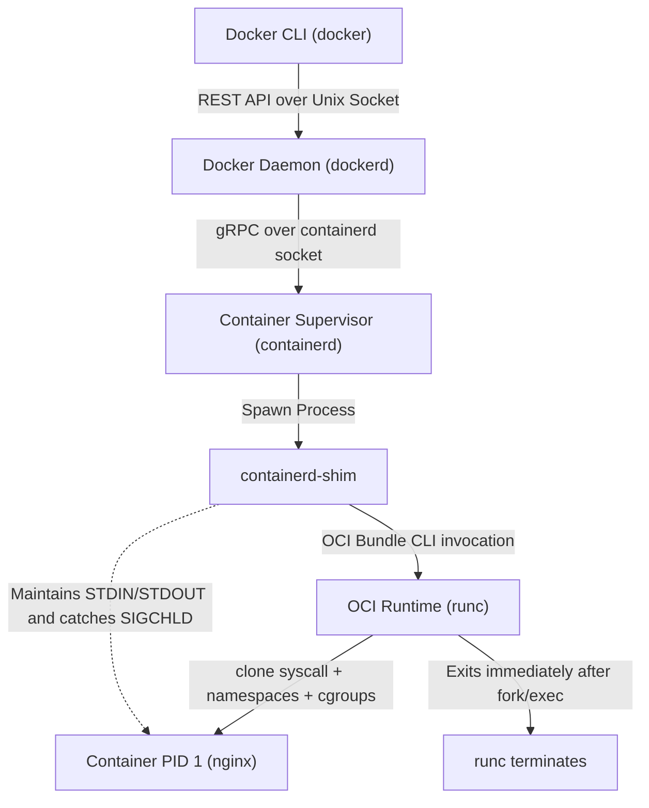
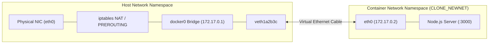

# Learn Docker: The Complete Beginner-to-Expert Masterclass

[](https://github.com/manthanank/learn-docker/actions/workflows/ci.yml)
[](https://github.com/manthanank/learn-docker/actions/workflows/docker.yml)
[](https://github.com/manthanank/learn-docker/actions/workflows/releases.yml)
[](https://nodejs.org/)
[](LICENSE)
[](https://opencontainers.org/)

An exhaustive, authoritative, **beginner-to-expert guide** and interactive platform for Docker and container virtualization. This curriculum begins with absolute zero-prerequisite fundamentals, walks through intermediate multi-container development, advances into production optimization and security, and culminates in Linux kernel internals (`runc`, `containerd`, Namespaces, Cgroups v2, OverlayFS, and iptables NAT).

---

## Pedagogical Roadmap: Beginner to Expert

```text
+-----------------------------------------------------------------------------------------------+
|                               THE DOCKER LEARNING JOURNEY                                     |
+-------------------+-------------------+-----------------------+-------------------------------+
| STAGE 1           | STAGE 2           | STAGE 3               | STAGE 4 & 5                   |
| Absolute Beginner | Intermediate Dev  | Advanced Production   | Expert Internals & Staff Arch |
+-------------------+-------------------+-----------------------+-------------------------------+
| • What is Docker? | • Docker Compose  | • Multi-Stage Builds  | • OCI Stack (dockerd, runc)   |
| • Images vs Cont. | • Multi-Service   | • BuildKit Caching    | • Linux Namespaces & Cgroups  |
| • First Container | • Networking & DNS| • Distroless/Alpine   | • Overlay2 CoW & Inodes       |
| • First Dockerfile| • Named Volumes   | • CIS Hardening       | • iptables NAT & veth Routing |
| • Port Mapping    | • Bind Mounts Dev | • Signals & PID 1     | • Kubernetes Migration        |
| • Basic 10 Cmds   | • Docker Hub Push | • Resource Quotas     | • 25 Staff Interview Q&A      |
+-------------------+-------------------+-----------------------+-------------------------------+
```

---

## Table of Contents
1. [Stage 1: Absolute Beginner Foundations](#1-stage-1-absolute-beginner-foundations)
   - [The "Works on My Machine" Dilemma](#the-works-on-my-machine-dilemma)
   - [Core Mental Models: Image vs Container vs Registry](#core-mental-models-image-vs-container-vs-registry)
   - [Running Your First Container: `hello-world` & `nginx`](#running-your-first-container-hello-world--nginx)
   - [Essential CLI Commands for Everyday Use](#essential-cli-commands-for-everyday-use)
   - [Writing Your Very First Dockerfile (Step-by-Step)](#writing-your-very-first-dockerfile-step-by-step)
   - [Port Forwarding Demystified (`-p 8080:80`)](#port-forwarding-demystified--p-808080)
   - [Container Ephemerality & Basic Volumes](#container-ephemerality--basic-volumes)
2. [Stage 2: Intermediate Multi-Container Workflows](#2-stage-2-intermediate-multi-container-workflows)
   - [Why Single Containers Aren't Enough](#why-single-containers-arent-enough)
   - [Docker Compose: Multi-Service Declarative Orchestration](#docker-compose-multi-service-declarative-orchestration)
   - [Container Networking: Service Discovery by DNS](#container-networking-service-discovery-by-dns)
   - [Data Persistence: Named Volumes vs Bind Mounts for Local Dev](#data-persistence-named-volumes-vs-bind-mounts-for-local-dev)
   - [Environment Variables, `.env` Files & Configurations](#environment-variables-env-files--configurations)
   - [Pushing and Versioning on Docker Hub](#pushing-and-versioning-on-docker-hub)
3. [Stage 3: Advanced Optimization & Production Engineering](#3-stage-3-advanced-optimization--production-engineering)
   - [Multi-Stage Builds: Slashing Image Sizes from 1.2GB to 80MB](#multi-stage-builds-slashing-image-sizes-from-12gb-to-80mb)
   - [BuildKit Architecture & Cache Mounts (`--mount=type=cache`)](#buildkit-architecture--cache-mounts---mounttypecache)
   - [Secret Mounts (`--mount=type=secret`) vs Environment Leaks](#secret-mounts---mounttypesecret-vs-environment-leaks)
   - [Base Image Selection: Ubuntu vs Debian-Slim vs Alpine vs Distroless](#base-image-selection-ubuntu-vs-debian-slim-vs-alpine-vs-distroless)
   - [Signals, PID 1, and Init Systems (`tini`, `dumb-init`)](#signals-pid-1-and-init-systems-tini-dumb-init)
   - [Healthchecks & Automatic Container Healing](#healthchecks--automatic-container-healing)
   - [Resource Limits: Preventing Starvation with CPU & Memory Constraints](#resource-limits-preventing-starvation-with-cpu--memory-constraints)
4. [Stage 4: Expert Internals & Kernel Primitives](#4-stage-4-expert-internals--kernel-primitives)
   - [The OCI Runtime Architecture: `dockerd`, `containerd`, `shim`, `runc`](#the-oci-runtime-architecture-dockerd-containerd-shim-runc)
   - [Linux Namespaces: PID, NET, MNT, UTS, IPC, USER](#linux-namespaces-pid-net-mnt-uts-ipc-user)
   - [Linux Cgroups v2: Completely Fair Scheduler (CFS) & OOM Killer](#linux-cgroups-v2-completely-fair-scheduler-cfs--oom-killer)
   - [Storage Drivers & Overlay2 UnionFS (LowerDir, UpperDir, CoW, Whiteouts)](#storage-drivers--overlay2-unionfs-lowerdir-upperdir-cow-whiteouts)
   - [Docker Network Routing: veth Pairs, Bridge Switching & iptables NAT](#docker-network-routing-veth-pairs-bridge-switching--iptables-nat)
   - [Rootless Docker & Attack Vector Mitigations](#rootless-docker--attack-vector-mitigations)
5. [Stage 5: Enterprise DevOps & Kubernetes Migration](#5-stage-5-enterprise-devops--kubernetes-migration)
   - [Docker CLI Power Tools & JSON Go Templates](#docker-cli-power-tools--json-go-templates)
   - [Docker Compose to Kubernetes (K8s) Architectural Migration](#docker-compose-to-kubernetes-k8s-architectural-migration)
   - [CI/CD Pipelines & Multi-Arch Buildx (AMD64 & ARM64)](#cicd-pipelines--multi-arch-buildx-amd64--arm64)
6. [Stage 6: Staff & Principal DevOps Interview Masterclass (25 Q&A)](#6-stage-6-staff--principal-devops-interview-masterclass-25-qa)
7. [Stage 7: Interactive Simulator, CLI & REST API Reference](#7-stage-7-interactive-simulator-cli--rest-api-reference)

---
## 1. Stage 1: Absolute Beginner Foundations

### The "Works on My Machine" Dilemma

Before containers, shipping software was plagued by environmental discrepancies:
- Developer Alice develops on macOS with Python 3.11 and SQLite 3.39.
- Developer Bob tests on Windows 11 with Python 3.10 and missing C++ compiler tools.
- Production runs on Red Hat Enterprise Linux 8 with Python 3.9 and an outdated OpenSSL library.

The application crashes in production with: `ImportError: /lib64/libc.so.6: version 'GLIBC_2.34' not found`.

**What Docker Does**:
Docker packages the **application code**, **runtime engine** (Node.js, Python, Go, Java), **system libraries**, **package dependencies**, and **exact filesystem configuration** into an immutable, self-contained unit called an **Image**. If an image runs on developer Alice's laptop, it will run identically on Bob's laptop, on AWS ECS, on Azure Kubernetes Service, and on Google Cloud Run.

---

### Core Mental Models: Image vs Container vs Registry

To master Docker, understand this fundamental tri-part relationship:

```text
+---------------------+         docker build          +---------------------+
|     Dockerfile      |  ─────────────────────────▶   |    Docker Image     |
| (Source Blueprint)  |                               | (Class / Static DVD)|
+---------------------+                               +---------------------+
                                                                 │
                                                       docker run│
                                                                 ▼
+---------------------+         docker push           +---------------------+
|   Docker Registry   |  ◀─────────────────────────   |  Docker Container   |
| (Docker Hub / ECR)  |                               | (Object / Live App) |
+---------------------+                               +---------------------+
```

1. **Dockerfile**: A plain text configuration file containing instructions (`FROM`, `COPY`, `RUN`, `CMD`) to build an image.
2. **Docker Image**: An immutable, read-only template with all dependencies baked in. Think of an image as a **Class** in Object-Oriented Programming, or a **Read-Only ISO / DVD**.
3. **Docker Container**: A runnable, isolated instance of an image. Think of a container as an **Object (instance of a class)** in OOP. You can spawn 1, 10, or 100 containers from a single image.
4. **Registry**: A remote repository store (such as Docker Hub, AWS ECR, GitHub Packages) where images are published and pulled.

---

### Running Your First Container: `hello-world` & `nginx`

Let's execute your first container. Open your terminal:

```bash
docker run hello-world
```

#### What happens behind the scenes:
1. Docker CLI queries the local image cache for an image named `hello-world:latest`.
2. Finding no local copy, the daemon contacts Docker Hub registry: `Unable to find image 'hello-world:latest' locally... Pulling from library/hello-world`.
3. The daemon downloads the layer filesystem and verifies the sha256 checksum.
4. The daemon assigns an isolated container sandbox, starts the entrypoint binary, prints the greeting message to your screen, and cleanly exits.

Now, let's run a persistent background web server:

```bash
docker run -d -p 8080:80 --name my-web-server nginx:alpine
```

- `-d` (**detached mode**): Runs the container in the background, freeing your terminal.
- `-p 8080:80` (**port publishing**): Maps port `8080` on your host computer to port `80` inside the container.
- `--name my-web-server`: Gives the container a human-readable identifier.
- `nginx:alpine`: The image name and tag (Alpine Linux version of NGINX).

Open your browser and navigate to `http://localhost:8080`. You will see the **"Welcome to nginx!"** landing page!

---

### Essential CLI Commands for Everyday Use

Here are the 10 fundamental commands you will use daily:

| Command | Action | Example |
| :--- | :--- | :--- |
| `docker run` | Create and start a container | `docker run -d -p 3000:3000 node:22-alpine` |
| `docker ps` | List active running containers | `docker ps` |
| `docker ps -a` | List all containers (running & stopped) | `docker ps -a` |
| `docker stop` | Gracefully stop a running container | `docker stop my-web-server` |
| `docker start` | Restart an existing stopped container | `docker start my-web-server` |
| `docker rm` | Delete a stopped container | `docker rm my-web-server` |
| `docker images` | List locally downloaded images | `docker images` |
| `docker rmi` | Delete a local image | `docker rmi nginx:alpine` |
| `docker logs` | View container console stdout/stderr | `docker logs -f my-web-server` |
| `docker exec` | Run an interactive shell inside container| `docker exec -it my-web-server sh` |

---

### Writing Your Very First Dockerfile (Step-by-Step)

Let's containerize a simple Node.js web server. Create a project folder with two files:

**`server.js`**:
```javascript
const http = require('http');
const server = http.createServer((req, res) => {
  res.writeHead(200, { 'Content-Type': 'application/json' });
  res.end(JSON.stringify({ message: "Hello from inside Docker!", uptime: process.uptime() }));
});
server.listen(3000, '0.0.0.0', () => console.log("Server listening on port 3000"));
```

**`Dockerfile`**:
```dockerfile
# 1. Base Image: Start with an official lightweight Linux environment with Node pre-installed
FROM node:22-alpine

# 2. Working Directory: Set the internal folder where commands execute
WORKDIR /app

# 3. Copy Source Code: Transfer server.js from host to /app inside container
COPY server.js .

# 4. Expose Port: Document that the container process listens on port 3000
EXPOSE 3000

# 5. Default Command: The instruction that executes when container launches
CMD ["node", "server.js"]
```

#### Build & Run Your Image:
```bash
# Build the image and tag it as 'my-first-app:1.0'
docker build -t my-first-app:1.0 .

# Run the image as a container
docker run -d -p 3000:3000 --name running-app my-first-app:1.0

# Verify by querying HTTP endpoint
curl http://localhost:3000
# Response: {"message":"Hello from inside Docker!","uptime":1.42}
```

---

### Port Forwarding Demystified (`-p 8080:80`)

A common stumbling block for beginners is understanding port mapping:

```text
Host Operating System (Laptop)                 Container Sandbox
+-------------------------------+              +-------------------------------+
| User hits:                    |              | Internal Web Server           |
| http://localhost:8080         |              | listens on port 80            |
|                               |              |                               |
|       Host Port: 8080         |   Forward    |     Container Port: 80        |
|    [ 0.0.0.0:8080 ] ──────────┼──────────────┼────▶ [ 172.17.0.2:80 ]         |
+-------------------------------+              +-------------------------------+
```

The syntax is always: `-p <Host_Port>:<Container_Port>`.
- If you run `-p 5000:3000`, external visitors connect via `http://localhost:5000`. Docker intercepts that traffic and routes it to port `3000` inside the container.
- If you omit `-p`, the container runs in complete network isolation; external machines cannot reach it!

---

### Container Ephemerality & Basic Volumes

Containers are **ephemeral** (stateless by default). If you write a file inside a container and delete the container (`docker rm`), the file is permanently destroyed!

To persist data (such as database records or uploaded media), use **Volumes**:

```bash
# Create a managed Docker named volume
docker volume create my-database-data

# Mount the volume into the container
docker run -d -v my-database-data:/var/lib/postgresql/data postgres:16-alpine
```

Even if you destroy the Postgres container, `my-database-data` remains intact on the host storage disk. Spawning a new container and mounting the same volume restores all database data immediately!

---
## 2. Stage 2: Intermediate Multi-Container Workflows

### Why Single Containers Aren't Enough

Real-world enterprise applications are composed of multiple collaborating services:
1. **Frontend Web Client**: React / Vue / Next.js served via NGINX.
2. **Backend API**: Node.js Express, Python FastAPI, or Go microservice.
3. **Primary Database**: PostgreSQL or MySQL.
4. **In-Memory Cache**: Redis.
5. **Message Broker**: RabbitMQ or Apache Kafka.

Manually executing `docker run` five times with custom networks, port mappings, and environment variables is error-prone, unversioned, and fragile.

---

### Docker Compose: Multi-Service Declarative Orchestration

**Docker Compose** lets you define, configure, and boot your entire multi-service stack with a single declarative YAML file and a single command: `docker compose up -d`.

Create `docker-compose.yml`:

```yaml
version: "3.8"

services:
  # Backend API service
  api:
    build:
      context: .
      dockerfile: Dockerfile
    ports:
      - "3000:3000"
    environment:
      - PORT=3000
      - DATABASE_URL=postgres://appuser:appsecret@db:5432/production_db
      - REDIS_URL=redis://cache:6379
    depends_on:
      db:
        condition: service_healthy
      cache:
        condition: service_started
    networks:
      - internal-app-net

  # PostgreSQL Database
  db:
    image: postgres:16-alpine
    environment:
      POSTGRES_USER: appuser
      POSTGRES_PASSWORD: appsecret
      POSTGRES_DB: production_db
    volumes:
      - pg-storage:/var/lib/postgresql/data
    healthcheck:
      test: ["CMD-SHELL", "pg_isready -U appuser -d production_db"]
      interval: 10s
      timeout: 5s
      retries: 5
    networks:
      - internal-app-net

  # Redis In-Memory Cache
  cache:
    image: redis:7-alpine
    networks:
      - internal-app-net

# Persistent Named Volumes
volumes:
  pg-storage:
    driver: local

# Isolated User-Defined Bridge Network
networks:
  internal-app-net:
    driver: bridge
```

#### The Power of `docker compose` Commands:
```bash
# Start entire microservices stack in background
docker compose up -d

# View consolidated streaming logs across all services
docker compose logs -f

# Check status and health of all stack containers
docker compose ps

# Scale the backend API to 3 parallel instances
docker compose up -d --scale api=3

# Tear down the stack and remove internal networks
docker compose down

# Tear down stack AND wipe persistent volumes
docker compose down -v
```

---

### Container Networking: Service Discovery by DNS

Notice how in the `docker-compose.yml` above:
- The backend API connects to Postgres using hostname `db`: `postgres://appuser:appsecret@db:5432/production_db`.
- The backend API connects to Redis using hostname `cache`: `redis://cache:6379`.

**How this works**:
When you define a custom network in Docker Compose, Docker automatically spins up an **Embedded DNS Server at `127.0.0.11`**.
Every service registered on the network automatically resolves other containers by their **Service Name**! You never need to hardcode brittle private IP addresses (like `172.18.0.4`).

---

### Data Persistence: Named Volumes vs Bind Mounts for Local Dev

Developers frequently confuse **Named Volumes** and **Bind Mounts**. Here is when to use each:

```text
+-------------------+-----------------------------------+-----------------------------------+
| Feature           | Named Volume                      | Bind Mount                        |
+-------------------+-----------------------------------+-----------------------------------+
| **Syntax**        | `-v my-vol:/var/lib/postgresql`   | `-v $(pwd)/src:/app/src`          |
| **Host Location** | `/var/lib/docker/volumes/<name>`  | Direct host project directory     |
| **Management**    | Fully managed by Docker daemon    | Managed directly by user / host OS|
| **Performance**   | Maximum native I/O throughput     | May have filesystem sync overhead |
| **Best For**      | Production databases, caches      | **Local development live reload** |
+-------------------+-----------------------------------+-----------------------------------+
```

#### Hot Reloading Code in Development:
```bash
# Mount host current directory into /app inside container:
docker run -it -p 3000:3000 -v $(pwd):/app -v /app/node_modules node:22-alpine sh
```
When you edit a file in VS Code or your IDE on your host machine, the changes reflect inside the container instantaneously without rebuilding the image!

---

### Environment Variables, `.env` Files & Configurations

Never commit hardcoded database credentials or API keys to your Dockerfile. Use environment variables:

Create a `.env` file in the same directory as `docker-compose.yml`:
```bash
DB_USER=master_admin
DB_PASS=Sup3rS3cr3tP@ssw0rd!
DB_NAME=fintech_production
```

Reference them in `docker-compose.yml`:
```yaml
services:
  db:
    image: postgres:16-alpine
    environment:
      POSTGRES_USER: ${DB_USER}
      POSTGRES_PASSWORD: ${DB_PASS}
      POSTGRES_DB: ${DB_NAME}
```

Docker Compose automatically interpolates values from `.env` at launch.

---

### Pushing and Versioning on Docker Hub

Once your image is tested and verified, publish it to a container registry:

```bash
# 1. Log into your Docker Hub account
docker login -u <your-dockerhub-username>

# 2. Tag your local image with your repository namespace and version tag
docker tag my-first-app:1.0 <your-dockerhub-username>/my-first-app:1.0.0
docker tag my-first-app:1.0 <your-dockerhub-username>/my-first-app:latest

# 3. Push both tags to Docker Hub
docker push <your-dockerhub-username>/my-first-app:1.0.0
docker push <your-dockerhub-username>/my-first-app:latest
```

Now anyone in the world (or your deployment servers) can pull and run your app with:
`docker run -d -p 3000:3000 <your-dockerhub-username>/my-first-app:1.0.0`.

---
## 3. Stage 3: Advanced Optimization & Production Engineering

### Multi-Stage Builds: Slashing Image Sizes from 1.2GB to 80MB

A common anti-pattern among novice engineers is shipping compilers, SDKs, development tools (`gcc`, `python3-dev`, `npm`, TypeScript compiler), and test suites in production container images. This causes:
1. Massive image downloads (1.5GB+ per release), slowing deployment latency.
2. Huge attack surface containing hundreds of unnecessary vulnerable binaries.

**Multi-Stage Builds** solve this by using multiple `FROM` lines in a single Dockerfile. Artifacts produced in early compiler stages are copied into a lean production runner stage:

```dockerfile
# ========================================================
# Stage 1: Build & Compilation Environment (Heavy SDK)
# ========================================================
FROM node:22-alpine AS builder

WORKDIR /app

# Copy package manifests first to leverage Docker layer caching
COPY package*.json tsconfig.json ./

# Install ALL dependencies (including devDependencies required for build)
RUN npm ci

# Copy application source code
COPY src/ ./src/

# Compile TypeScript into JavaScript in dist/
RUN npm run build

# Remove development dependencies, retaining only production modules
RUN npm prune --production

# ========================================================
# Stage 2: Hardened Minimal Production Runner (Lean)
# ========================================================
FROM node:22-alpine AS runner

# Security: Create dedicated unprivileged system user (CIS Benchmark 4.1)
RUN addgroup -S -g 1001 appgroup && \
    adduser -S -u 1001 -G appgroup appuser

WORKDIR /app
ENV NODE_ENV=production PORT=3000

# Copy ONLY built artifacts and production dependencies from builder
COPY --from=builder --chown=appuser:appgroup /app/package*.json ./
COPY --from=builder --chown=appuser:appgroup /app/node_modules ./node_modules
COPY --from=builder --chown=appuser:appgroup /app/dist ./dist

# Drop root privileges
USER appuser

EXPOSE 3000

# Add Container Healthcheck
HEALTHCHECK --interval=30s --timeout=5s --start-period=5s --retries=3 \
  CMD wget --spider -q http://localhost:3000/health || exit 1

# Graceful termination
STOPSIGNAL SIGTERM

CMD ["node", "dist/server.js"]
```

#### Size Comparison:
- Single-Stage image with build tools: **1.24 GB**
- Multi-Stage hardened image: **86 MB** (93% reduction!)

---

### BuildKit Architecture & Cache Mounts (`--mount=type=cache`)

Modern Docker features **BuildKit** (`DOCKER_BUILDKIT=1`), which replaces the legacy linear build engine with a concurrent Directed Acyclic Graph (DAG) executor.

BuildKit introduces **Cache Mounts**, which persist package manager caches across builds on the host without baking them into the resulting image layers:

```dockerfile
# syntax=docker/dockerfile:1.4
FROM node:22-alpine AS builder
WORKDIR /app

COPY package*.json ./

# Cache mount preserves /root/.npm across builds on host disk!
RUN --mount=type=cache,target=/root/.npm \
    npm ci

COPY . .
RUN npm run build
```

---

### Secret Mounts (`--mount=type=secret`) vs Environment Leaks

Never pass private SSH keys, tokens, or credentials via `ARG` or `ENV`. Anyone who runs `docker history --no-trunc <image>` can read your secrets in plaintext!

Use BuildKit Secret Mounts:
```dockerfile
# syntax=docker/dockerfile:1.4
FROM alpine:3.18
RUN apk add --no-cache git openssh-client

# Secret is mounted in memory temporarily at /run/secrets/gh_token during RUN
RUN --mount=type=secret,id=gh_token \
    TOKEN=$(cat /run/secrets/gh_token) && \
    git clone https://${TOKEN}@github.com/my-org/private-repo.git /app
```

Execute build with:
```bash
docker build --secret id=gh_token,src=~/.github_token -t private-app .
```
The secret exists only in RAM during the `RUN` execution and is completely absent from the final image layers!

---

### Base Image Selection: Ubuntu vs Debian-Slim vs Alpine vs Distroless

```text
+-------------------+---------------+---------------+---------------------------------------+
| Base Image        | Typical Size  | C Library     | Enterprise Assessment                 |
+-------------------+---------------+---------------+---------------------------------------+
| `ubuntu:22.04`    | ~77 MB        | glibc         | Heavy. Contains shells, package tools.|
| `debian:12-slim`  | ~55 MB        | glibc         | Excellent balance of glibc & size.    |
| `alpine:3.19`     | ~7 MB         | musl libc     | Ultra-lean. Note: musl can cause C-lib|
|                   |               |               | performance diffs in Python numpy/ML. |
| `gcr.io/distroless`| ~20 MB       | glibc         | **Zero shell (`/bin/sh`), zero tools.**|
|                   |               |               | Ultimate security posture.            |
| `scratch`         | **0 MB**      | None          | Empty filesystem. Ideal for statically|
|                   |               |               | compiled Go / Rust binaries.          |
+-------------------+---------------+---------------+---------------------------------------+
```

---

### Signals, PID 1, and Init Systems (`tini`, `dumb-init`)

In Linux, PID 1 has special status: the kernel will not apply default signal actions (such as terminating on `SIGTERM`) unless the process explicitly registers a signal handler!

#### Shell Form vs JSON Exec Form
```dockerfile
# ANTI-PATTERN (Shell Form):
CMD node server.js
# Spawns: /bin/sh -c "node server.js"
# /bin/sh becomes PID 1 and ignores SIGTERM. docker stop hangs for 10s before SIGKILL!

# PRODUCTION PATTERN (Exec Form):
CMD ["node", "server.js"]
# Node executes directly as PID 1 and receives SIGTERM immediately.
```

#### Handling Zombie Processes with `tini`:
If your application spawns background worker subprocesses, orphaned child processes become defunct "zombies" if PID 1 does not reap them. Use lightweight `tini`:

```dockerfile
RUN apk add --no-cache tini
ENTRYPOINT ["/sbin/tini", "--"]
CMD ["node", "server.js"]
```

---

### Resource Limits: Preventing Starvation with CPU & Memory Constraints

In production, an unconstrained container with a memory leak can consume all host RAM, causing the Linux kernel to crash or kill critical system daemons. Always enforce limits:

```bash
docker run -d \
  --name bounded-app \
  --memory="512m" \
  --memory-reservation="256m" \
  --cpus="1.5" \
  --pids-limit=200 \
  -p 3000:3000 my-app:latest
```

- `--memory="512m"`: Hard memory ceiling. If the container tries to consume more than 512MB, the Linux OOM Killer terminates it (exit code 137).
- `--cpus="1.5"`: Restricts container execution to at most 1.5 CPU cores across CFS scheduling periods.
- `--pids-limit=200`: Prevents fork-bombs from exhausting host PID tables.

---
## 4. Stage 4: Expert Internals & Kernel Primitives

### The OCI Runtime Architecture: `dockerd`, `containerd`, `shim`, `runc`

There is no single monolithic "Docker binary" that runs containers. Docker coordinates a modular stack standardized under the Open Container Initiative (OCI):



1. **`dockerd`**: User-facing daemon managing networks, volumes, image builds (BuildKit), and CLI REST endpoints.
2. **`containerd`**: CNCF graduated container supervisor. Manages layer snapshotters, image pulls, and tracks container execution state.
3. **`containerd-shim`**: Sits between `containerd` and the running container. Keeps STDIN/STDOUT descriptors open and captures exit codes. This allows `dockerd` and `containerd` to restart during upgrades without killing active containers!
4. **`runc`**: Low-level reference implementation of the OCI runtime spec. Interacts directly with Linux kernel: executes `clone(2)` with namespace flags, sets cgroups, calls `pivot_root`, and drops capabilities before handing execution to the application. `runc` exits immediately after launching the container.

---

### Linux Namespaces: PID, NET, MNT, UTS, IPC, USER

Namespaces partition kernel resources so that each container sees its own isolated view of the operating system:

```text
+---------------------------------------------------------------------------------------------+
|                                    LINUX NAMESPACES TAXONOMY                                |
+---------------+---------------------+-------------------------------------------------------+
| Namespace     | Kernel Flag         | Isolated System Resource                              |
+---------------+---------------------+-------------------------------------------------------+
| **PID**       | `CLONE_NEWPID`      | Process IDs (PID 1 inside container, maps to host PID)|
| **NET**       | `CLONE_NEWNET`      | Network devices, IP routing tables, iptables, ports   |
| **MNT**       | `CLONE_NEWNS`       | Filesystem mount points (chroot, pivot_root)          |
| **UTS**       | `CLONE_NEWUTS`      | Hostname and NIS domain name                          |
| **IPC**       | `CLONE_NEWIPC`      | POSIX message queues and System V IPC shared memory   |
| **USER**      | `CLONE_NEWUSER`     | UID and GID mapping (root in container is non-root)   |
| **CGROUP**    | `CLONE_NEWCGROUP`   | Cgroup hierarchy visibility in /proc/self/cgroup       |
| **TIME**      | `CLONE_NEWTIME`     | Boot and monotonic system clock virtualization        |
+---------------+---------------------+-------------------------------------------------------+
```

---

### Linux Cgroups v2: Completely Fair Scheduler (CFS) & OOM Killer

While namespaces govern **visibility**, Control Groups (Cgroups) govern **resource consumption**.

In modern Linux distributions (systemd v247+, kernel 5.8+), Docker uses **Cgroups v2** (`/sys/fs/cgroup`), providing a unified hierarchy:

```text
/sys/fs/cgroup/docker/<container-id>/
  ├── cpu.max          (CFS quota & period: e.g. "50000 100000" = 0.5 CPU)
  ├── cpu.weight       (Relative CPU weight: 1..10000)
  ├── memory.max       (Hard memory limit in bytes: e.g. "536870912" = 512MB)
  ├── memory.high      (Soft throttling boundary)
  ├── memory.current   (Active memory consumption)
  ├── memory.events    (OOM kill counters: "oom 1")
  └── pids.max         (Maximum concurrent processes in cgroup)
```

#### Completely Fair Scheduler (CFS) Throttling
Docker configures CPU limits through the Linux CFS scheduler:
```text
Allocated CPU Cores = (cpu.max quota) / (cpu.max period)
```
For example, `--cpus=1.5` sets `cpu.max` to `150000 100000`. If a multi-threaded workload attempts to consume more than 150ms of CPU runtime within a 100ms wall-clock period, the kernel throttles the process until the next CFS period commences.

---

### Storage Drivers & Overlay2 UnionFS (LowerDir, UpperDir, CoW, Whiteouts)

Docker uses **Overlay2** to stack immutable image layers and present a single unified directory to the container:

```text
+-----------------------------------------------------------------------------------+
|                           OVERLAY2 DIRECTORY ARCHITECTURE                         |
+-----------------------------------------------------------------------------------+
|                                                                                   |
|  [ MergedDir ]    Unified container filesystem view presented to container apps   |
|         ▲         (/var/lib/docker/overlay2/<id>/merged)                          |
|         │                                                                         |
|  [ UpperDir ]     Read-Write Container Layer: New files, edits, and whiteouts     |
|         ▲         (/var/lib/docker/overlay2/<id>/diff)                            |
|         │                                                                         |
|  [ LowerDir ]     Immutable Read-Only Image Layers (Stacked Bottom-Up)            |
|                   (/var/lib/docker/overlay2/<l3>/diff : <l2>/diff : <l1>/diff)    |
|                                                                                   |
+-----------------------------------------------------------------------------------+
|  [ WorkDir ]      Internal atomic scratch directory for staging CoW renames       |
+-----------------------------------------------------------------------------------+
```

- **Copy-on-Write (CoW)**: When a process inside a container edits an existing file from an image layer, Overlay2 copies the file from `LowerDir` to `UpperDir` before applying changes. The underlying image layer remains completely untouched!
- **Whiteout Files (`.wh.<filename>`)**: When a container deletes a file residing in a lower layer, Overlay2 creates a character device node `0/0` prefixed with `.wh.` in `UpperDir`, instructing the driver to hide the file in `MergedDir`.

---

### Docker Network Routing: veth Pairs, Bridge Switching & iptables NAT



1. **Virtual Ethernet (`veth`) Pair**: Acts as a virtual patch cord between host and container namespaces.
2. **`docker0` Bridge**: Operates as a Layer-2 software switch forwarding Ethernet frames across containers on `172.17.0.0/16`.
3. **iptables Port Forwarding (DNAT)**:
   ```bash
   -A DOCKER -p tcp -m tcp --dport 8080 -j DNAT --to-destination 172.17.0.2:3000
   ```
4. **Outbound Internet Access (SNAT / MASQUERADE)**:
   ```bash
   -A POSTROUTING -s 172.17.0.0/16 ! -o docker0 -j MASQUERADE
   ```

---
## 5. Stage 5: Enterprise DevOps & Kubernetes Migration

### Docker CLI Power Tools & JSON Go Templates

```bash
# Extract private IP address of container on specific network
docker inspect -f '{{range .NetworkSettings.Networks}}{{.IPAddress}}{{end}}' prod-api

# Extract Host PID of PID 1 inside container
docker inspect -f '{{.State.Pid}}' prod-api

# Check container health status and failure logs
docker inspect -f '{{.State.Health.Status}}' prod-api
docker inspect -f '{{json .State.Health.Log}}' prod-api | jq .

# Inspect mounted volumes and host paths
docker inspect -f '{{range .Mounts}}{{.Source}} -> {{.Destination}} ({{.Type}}){{"\n"}}{{end}}' prod-api

# Live streaming resource stats table
docker stats --no-stream --format "table {{.Name}}\t{{.CPUPerc}}\t{{.MemUsage}}\t{{.NetIO}}\t{{.PIDs}}"

# Analyze comprehensive Docker disk space consumption
docker system df -v

# Clean up all stopped containers, unused networks, and dangling images
docker system prune -a --volumes -f
```

---

### Docker Compose to Kubernetes (K8s) Architectural Migration

When migrating from Docker Compose to distributed Kubernetes:

```text
+-----------------------------------+-----------------------------------+-----------------------------------+
| Docker / Docker Compose Primitive | Kubernetes Equivalent Object      | Architectural Role                |
+-----------------------------------+-----------------------------------+-----------------------------------+
| Container                         | **Container** (inside Pod)        | Smallest unit of computation      |
| Service (Single Container)        | **Pod**                           | Shared network & storage unit     |
| Service (Replicated Scaled)       | **Deployment** + **ReplicaSet**   | Declarative desired-state scaling |
| Stateful Service (Database)       | **StatefulSet**                   | Stable network IDs & disk binding |
| System Agent per Host             | **DaemonSet**                     | Exactly one copy per cluster node |
| Scheduled Batch Job               | **CronJob** / **Job**             | Finite task execution             |
| `ports: ["80:80"]`                | **Service** (ClusterIP/NodePort)  | Stable virtual IP & load balancer |
| Virtual Host / Reverse Proxy      | **Ingress** / Gateway API         | L7 routing, TLS termination       |
| `environment: [KEY=VAL]`          | **ConfigMap**                     | Decoupled runtime configuration   |
| Hardcoded Credentials             | **Secret**                        | Base64 encoded / KMS encrypted    |
| Named Volume                      | **PersistentVolumeClaim (PVC)**   | Dynamic block/file storage claim  |
| Bridge Network                    | **CNI Plugin** (Calico, Cilium)   | Flat Pod-to-Pod IP routability    |
| `HEALTHCHECK`                     | **Liveness & Readiness Probes**   | Health evaluation & traffic gates |
+-----------------------------------+-----------------------------------+-----------------------------------+
```

---
## 6. Stage 6: Staff & Principal DevOps Interview Masterclass (25 Q&A)

### Q1: What is the exact execution flow when running `docker run`? Detail every boundary crossed.
**Answer:**
When `docker run` executes:
1. **Client -> Daemon**: The Docker CLI converts user parameters into an HTTP JSON request transmitted across `/var/run/docker.sock` to `dockerd`.
2. **Daemon -> Registry**: If image layers are not cached locally, `dockerd` delegates pulling to `containerd` via gRPC, downloading and verifying content-addressable layer SHA256 hashes against the manifest.
3. **Storage Snapshot**: `containerd` invokes its snapshotter driver (`overlay2`) to prepare an immutable lower layer stack, an empty read-write upper layer, and a work directory.
4. **OCI Spec Assembly**: `containerd` serializes container configuration into an OCI `config.json` bundle containing mount paths, namespace flags, cgroup limits, and capability sets.
5. **Shim & runc**: `containerd` forks a `containerd-shim` process. The shim executes `runc create <id>`.
6. **Kernel Execution**: `runc` invokes the `clone(2)` syscall with namespace flags (`CLONE_NEWPID`, `CLONE_NEWNET`, `CLONE_NEWNS`, etc.), writes resource constraints into `/sys/fs/cgroup/<id>/`, executes `pivot_root`, drops Linux capabilities, applies seccomp filters, and executes `execve` to start PID 1.
7. **runc Exit**: `runc` exits immediately. The `containerd-shim` process remains as the parent of PID 1 to handle signal propagation and I/O streaming.

---

### Q2: How does `pivot_root` differ from `chroot`, and why is `chroot` insufficient for container security?
**Answer:**
`chroot(2)` only alters the apparent root directory (`/`) for the current process and its children. It does not alter mount namespaces. If an attacker gains root privileges inside a `chroot` jail, they can break out by creating a temporary directory, opening a file descriptor to the original root via relative traversal (`../../`), and calling `chroot` back to the host filesystem.
<br><br>
In contrast, `pivot_root(2)` swaps the entire mount namespace root. It moves the root filesystem of the current process to a `put_old` directory and makes the new root filesystem the true root for all processes in the mount namespace. Once `pivot_root` succeeds, the old host root is unmounted (`umount2(put_old, MNT_DETACH)`), completely eliminating any file descriptor path back to the host root.

---

### Q3: Why does `docker stop` send SIGTERM and then SIGKILL after a timeout? How does Node.js or Python behave?
**Answer:**
`docker stop` allows applications to perform graceful shutdown: draining incoming HTTP requests, completing in-flight database transactions, and releasing distributed locks. It dispatches `SIGTERM` (signal 15) to PID 1 inside the container and starts a countdown timer (default 10 seconds). If PID 1 has not terminated when the timer expires, the daemon issues `SIGKILL` (signal 9), which cannot be caught or ignored.
<br><br>
By default, Node.js and Python runtimes ignore `SIGTERM` when running as PID 1 unless explicit signal handlers are attached (`process.on('SIGTERM', ...)` in Node.js, `signal.signal(signal.SIGTERM, ...)` in Python). If developers omit signal trapping, `docker stop` always incurs the full 10-second penalty before hard crash!

---

### Q4: Explain the difference between Docker `ENTRYPOINT` and `CMD`. How do they interact?
**Answer:**
`ENTRYPOINT` specifies the executable that should always run when the container starts. `CMD` specifies default arguments that are appended to `ENTRYPOINT`.
- If both are specified in exec form: `ENTRYPOINT ["nginx"]` and `CMD ["-g", "daemon off;"]` evaluates to `nginx -g "daemon off;"`.
- If the user runs `docker run my-image -c /custom.conf`, the user argument overrides `CMD`, resulting in `nginx -c /custom.conf`.
- If `ENTRYPOINT` is defined in shell form (`ENTRYPOINT nginx -g "daemon off;"`), all `CMD` arguments and CLI parameters are ignored.

---

### Q5: What is Free-Threaded Python and how does PEP 703 impact Python Docker containers?
**Answer:**
Historically, Python containers scaling across multiple CPU cores required multi-process models (such as `gunicorn -w 4` or Celery workers) due to the Global Interpreter Lock (GIL). Multi-process architectures replicate memory footprints and complicate shared state. Python 3.13 introduces experimental **free-threaded CPython (PEP 703)**, removing the GIL via biased reference counting and mimalloc thread-safe memory allocators. In Docker containers, this allows a single Python container process to scale seamlessly across all CPU cores allocated via `--cpus=N` using multi-threading!

---

### Q6: How does Docker Compose resolve dependencies using Directed Acyclic Graphs (DAGs)?
**Answer:**
Docker Compose parses `depends_on` declarations into a Directed Acyclic Graph (DAG) where nodes represent services and directed edges represent boot dependencies. It applies **Kahn's Algorithm** or depth-first search (DFS) to compute the **Topological Sort**:
1. It calculates the in-degree (number of upstream dependencies) of every service.
2. Services with in-degree 0 (e.g. database, redis) are scheduled in Level 1 and booted concurrently.
3. Once upstream services pass readiness probes (`condition: service_healthy`), downstream services (e.g. API server, worker) are unblocked and started.
4. If a dependency loop is detected (e.g. Service A -> Service B -> Service A), Compose halts execution with a cyclic dependency error.

---

### Q7: What causes "Container Port Not Accessible" when a process binds to `127.0.0.1`?
**Answer:**
Each container has its own isolated Network Namespace (`CLONE_NEWNET`) with its own independent loopback interface (`lo`). If a server inside a container listens on `127.0.0.1:3000`, it binds exclusively to the container's private loopback adapter. Host port forwarding maps host requests to the container's virtual ethernet adapter (`eth0` at `172.17.0.2`). Packets arriving from `eth0` are dropped because the process is only listening on `lo`.
<br><br>
*Resolution:* Always bind servers inside containers to all interfaces: `0.0.0.0` or `::` (IPv6).

---

### Q8: What are Multi-Arch Container Images and how does Docker manifest list / OCI Index work?
**Answer:**
Modern cloud infrastructure runs on heterogeneous hardware (AMD64 x86_64 in Intel/AMD servers and ARM64 aarch64 in AWS Graviton, Apple Silicon, and Raspberry Pi). A **Manifest List** (or OCI Image Index) acts as a fat manifest containing pointers to architecture-specific image manifests. When a client issues `docker pull`, Docker inspects the local machine's architecture (`os` and `architecture`), queries the Manifest List, and pulls only the matching layer binaries.

---

### Q9: What is Rootless Docker, and how does it protect against kernel 0-day breakouts?
**Answer:**
Standard Docker executes `dockerd` and `containerd` as the host `root` user (`UID 0`). If a vulnerability in the Linux kernel or `runc` allows a container breakout (e.g. CVE-2019-5736 or CVE-2024-21626), the attacker lands on the host system with unrestricted root privileges.
<br><br>
**Rootless Docker** executes the entire container engine inside a user namespace (`CLONE_NEWUSER`). Host UID 1000 is mapped to UID 0 inside the engine namespace. If an attacker achieves a complete container breakout, they emerge on the host operating system as an unprivileged user (UID 1000) with zero access to host kernel modules, hardware devices, or other users' data!

---

### Q10: How does BuildKit cache mounting (`--mount=type=cache`) prevent image bloat?
**Answer:**
Standard Dockerfile instructions like `RUN npm install` download package archives into local directories (e.g. `/root/.npm`). In legacy builds, this cache is permanently stored in the resulting image layer unless manually cleared in the same instruction.
<br><br>
BuildKit's `--mount=type=cache,target=/root/.npm` mounts a persistent cache directory from the host BuildKit daemon directly into the build container during execution. The compiler reads and writes dependencies to this cache across successive builds, but the cache directory is excluded from the exported container image layer, producing ultra-compact production images with instantaneous rebuild speeds!

---

### Q11: What is the function of the `STOPSIGNAL` directive in a Dockerfile?
**Answer:**
By default, Docker sends `SIGTERM` when executing `docker stop`. Some applications and proxies do not use `SIGTERM` for graceful termination. For example, NGINX uses `SIGQUIT` for graceful worker shutdown, while `SIGTERM` triggers immediate abrupt abort. Defining `STOPSIGNAL SIGQUIT` in the Dockerfile informs the Docker runtime to dispatch `SIGQUIT` on `docker stop`, ensuring NGINX finishes serving active HTTP requests before exiting.

---

### Q12: How does the Linux Seccomp (Secure Computing) filter enhance container security?
**Answer:**
The Linux kernel exposes hundreds of system calls (`syscalls`). Most containerized applications only require a fraction (e.g. ~40-70 syscalls). Docker applies a default BPF (Berkeley Packet Filter) Seccomp profile that blocks over 40 dangerous syscalls, including `reboot`, `sys_chroot`, `kexec_load`, `keyctl`, `mount`, and `ptrace`. Even if an attacker gains root privileges inside a container, Seccomp intercepts attempts to call blocked syscalls and returns `EPERM` (Operation not permitted).

---

### Q13: What is the difference between `docker pause` and `docker stop`?
**Answer:**
- `docker stop`: Dispatches a `SIGTERM` signal to PID 1, allows process cleanup, and terminates the container. Memory pages and process states are released.
- `docker pause`: Uses the Linux Cgroups **freezer controller** (`cgroup.freeze` or `cgroups v1 freezer`). It suspends all processes in the container in their current state without signaling or terminating them. Memory state remains frozen in RAM. `docker unpause` resumes execution instantaneously without rebooting.

---

### Q14: How does Docker implement the Embedded DNS Server (`127.0.0.11`)?
**Answer:**
In user-defined bridge networks, Docker creates an iptables loopback redirection inside the container's network namespace:
- Any DNS request destined for `127.0.0.11:53` is forwarded to an internal listening socket managed by `dockerd`.
- The daemon checks its internal container registry table. If the queried hostname matches a container name or service alias on the same network, it returns the container's private IP.
- If unresolvable internally, Docker forwards the DNS query to external upstream DNS resolvers defined in `/etc/resolv.conf`.

---

### Q15: Why is `ADD` discouraged in favor of `COPY` for local files in a Dockerfile?
**Answer:**
`COPY` performs a simple, predictable copy of local files or directories into the container filesystem.
`ADD` has two additional implicit behaviors:
1. It downloads remote URLs into the container filesystem.
2. It automatically decompresses local tarballs (`.tar`, `.tar.gz`, `.tar.bz2`) into the destination directory.
Using `ADD` indiscriminately risks unexpected archive unpacking and complicates build caching. The recommended practice is to use `COPY` for all local files and use `ADD` strictly when auto-extracting tar archives.

---

### Q16: How do Distroless container images improve enterprise security posture?
**Answer:**
Distroless images (championed by Google) contain only application runtime binaries and dependencies—completely stripping out Linux shells (`/bin/sh`, `/bin/bash`), package managers (`apk`, `apt`), and core utilities (`curl`, `ls`, `cat`).
<br><br>
**Security Benefits**:
- Reduces Common Vulnerabilities and Exposures (CVEs) in base images to near zero.
- Prevents script-kiddie container breakouts: attackers cannot spawn a reverse shell or download malware via `curl` because no shell or binary loader exists in the container!

---

### Q17: What are Docker Volume drivers, and how do they enable distributed stateful workloads?
**Answer:**
The Docker Volume plugin interface allows third-party storage providers to manage container storage outside the local host filesystem:
- **Local Driver**: Stores data in `/var/lib/docker/volumes/` on the local host.
- **Distributed Drivers (NFS, AWS EFS, Ceph, GlusterFS, Portworx)**: Mount shared network storage into containers across multiple physical nodes. If a container crashes and reschedules on a different physical host, the volume driver reattaches the same network block storage seamlessly.

---

### Q18: How does the Linux CFS scheduler calculate CPU bandwidth throttle counters?
**Answer:**
Under Cgroups v2, CPU limits are tracked in `/sys/fs/cgroup/cpu.stat`:
- `nr_periods`: Total number of CFS enforcement periods elapsed.
- `nr_throttled`: Total number of periods in which processes inside the cgroup exhausted their quota and were throttled.
- `throttled_usec`: Total microseconds the processes were suspended waiting for quota reset.
Monitoring `nr_throttled / nr_periods` is the industry standard metric for detecting CPU starvation in containerized microservices.

---

### Q19: What is the purpose of `.dockerignore` and how does it optimize build context performance?
**Answer:**
When running `docker build .`, the Docker CLI tarballs the entire directory into a **Build Context** and streams it across the socket to the Docker daemon. If `.git/`, `node_modules/`, test fixtures, or large datasets are present, context transfer can take gigabytes of memory and minutes of transfer time. `.dockerignore` filters out unwanted files before building the context, accelerating build performance and preventing sensitive files (e.g. `.env`) from leaking into image layers.

---

### Q20: Explain the function and security implications of the Docker socket (`/var/run/docker.sock`).
**Answer:**
`/var/run/docker.sock` is the Unix domain socket through which the Docker CLI communicates with the Docker daemon (`dockerd`). Because `dockerd` runs with root privileges, anyone with write access to this socket possesses **equivalent host root access**.
<br><br>
Mounting `/var/run/docker.sock` into a container (e.g. `docker run -v /var/run/docker.sock:/var/run/docker.sock`) is a critical security vulnerability: any process inside the container can instruct the host daemon to spawn a privileged container mounting the host root filesystem (`/`), achieving instant host compromise!

---

### Q21: What is the difference between Macvlan and IPvlan network drivers?
**Answer:**
- **Macvlan**: Assigns a unique MAC address and IP address to each container. Packets appear directly on the physical switch. However, many enterprise switches restrict the number of MAC addresses per port (port security), limiting container density.
- **IPvlan**: All containers on the host share the physical host NIC's single MAC address, but each container receives an independent IP address. This overcomes switch MAC address limits while providing direct Layer-2/Layer-3 routing without bridge NAT overhead.

---

### Q22: What is the OCI Runtime Hook specification?
**Answer:**
OCI hooks allow custom binaries to execute at precise stages of container setup:
- `prestart`: Executed after namespaces and cgroups are created, but before `pivot_root` and before the container process starts. Frequently used by network plugins (CNI) to create veth pairs.
- `createRuntime`: Executed in the runtime namespace after resources are configured.
- `poststop`: Executed after the container process terminates to clean up network interfaces and temporary storage.

---

### Q23: How does Docker Swarm differ from Kubernetes for microservice orchestration?
**Answer:**
- **Docker Swarm**: Built directly into `dockerd`. Extremely easy to set up and operate (`docker swarm init`). Best suited for small to mid-sized engineering teams prioritizing developer ergonomics over extreme customizability.
- **Kubernetes (K8s)**: CNCF industry standard enterprise orchestrator. Decoupled control plane (etcd, kube-apiserver, kube-scheduler, kube-controller-manager). Supports advanced primitives (CRDs, Operators, Pod Disruption Budgets, HPA/VPA, Service Meshes). Higher operational complexity.

---

### Q24: What is an Opaque Directory in Overlay2, and why is it created?
**Answer:**
In OverlayFS, lower layers are read-only. If an image layer defines directory `/app/config` with files `a.txt` and `b.txt`, and a container user deletes the entire directory and recreates a new `/app/config` containing only `c.txt`:
Overlay2 marks `/app/config` in `UpperDir` with the extended attribute `trusted.overlay.opaque="y"` (or creates `.wh..wh..opq`). This tells the kernel to block inheritance from the lower `/app/config` layer, preventing `a.txt` and `b.txt` from bleeding into the new directory.

---

### Q25: What is the CIS Docker Benchmark recommendation for logging drivers?
**Answer:**
The default logging driver (`json-file`) stores standard output logs in `/var/lib/docker/containers/<id>/<id>-json.log`. Without log rotation, high-volume production services will exhaust host disk space.
<br><br>
*CIS Benchmark 2.12*: Configure daemon-wide log rotation in `/etc/docker/daemon.json`:
```json
{
  "log-driver": "json-file",
  "log-opts": {
    "max-size": "50m",
    "max-file": "5"
  }
}
```
Or stream logs directly to centralized observability platforms using drivers like `syslog`, `journald`, `fluentd`, or `awslogs`.

---
## 7. Stage 7: Interactive Simulator, CLI & REST API Reference

`learn-docker` includes a production-grade TypeScript simulation engine, command-line interface, and Express REST API.

### Command-Line Interface (CLI) Usage

```bash
# Display CLI help and available commands
learn-docker --help

# Lint and security scan a Dockerfile
learn-docker lint ./Dockerfile

# Run interactive Overlay2 UnionFS simulation (Copy-on-Write and Whiteout demonstration)
learn-docker overlay

# Validate Docker Compose DAG dependencies and display topological boot batches
learn-docker compose ./docker-compose.yml

# Launch interactive web dashboard
learn-docker serve --port 3000
```

### REST API Endpoints

| Method | Endpoint | Description | Sample Request Body |
| :--- | :--- | :--- | :--- |
| `GET` | `/health` | Service uptime and status | None |
| `POST` | `/api/dockerfile/parse` | Parse Dockerfile into structured AST | `{"dockerfile": "FROM alpine\nCMD ["echo"]"}` |
| `POST` | `/api/dockerfile/lint` | Run CIS Benchmark rules & vulnerability scanner | `{"dockerfile": "FROM node:latest\n..."}` |
| `POST` | `/api/overlayfs/simulate` | Execute CoW and Whiteout layer mutations | `{"actions": [{"op": "write", "path": "/test"}]}` |
| `POST` | `/api/isolation/simulate` | Simulate PID namespaces, CFS CPU burst, OOM | `{"action": "allocate_mem", "bytes": 500000000}` |
| `POST` | `/api/compose/resolve` | Parse Compose YAML and resolve dependency DAG | `{"yaml": "services:\n  app:\n    image: ..."}` |
| `POST` | `/api/container/lifecycle` | Step through state machine (start, pause, kill) | `{"action": "kill", "signal": "SIGKILL"}` |

---

## License
Distributed under the MIT License. See [LICENSE](LICENSE) for details.
